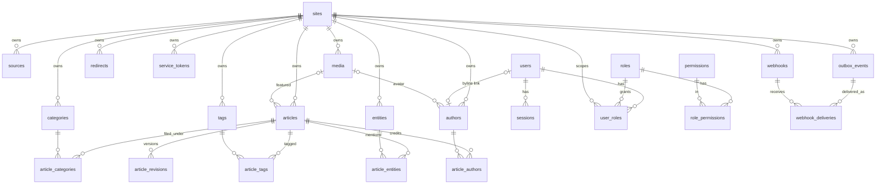

# Kal El — Database

Every table, its purpose, keys, constraints and indexes, as defined by the drizzle schema
and the migrations.

```
Reviewed against:
BRANCH: claude/kal-el-visual-ux-final-ade7eb
HEAD:   5de5b28b4a2a7a1d86a8f7a12b1493d3c73200f0
DATE:   2026-08-19
```

PostgreSQL. Schema in `packages/db/src/schema/`, migrations as SQL in
`packages/db/drizzle/` (`0000_furry_psynapse` … `0005_hot_sabretooth`).

Conventions throughout:

- primary keys are `uuid` with `DEFAULT gen_random_uuid()`;
- timestamps are `timestamptz`, `created_at`/`updated_at` default `now()`;
- enumerations are plain `text` columns — **not** PostgreSQL enums and **not**
  check-constrained. The value set is enforced only by the application (drizzle's
  TypeScript `enum` option and the zod contracts); the database accepts any string written
  outside the API;
- **`site_id` cascades on delete** — removing a site removes its content.

---

## 1. Entity relationships



Note what is **absent**: there is no `article_sources` table. `sources` is a site-level
taxonomy with no relationship to articles.

---

## 2. Sites

### `sites`

The tenant root.

| Column | Type | Notes |
|---|---|---|
| `id` | uuid PK | |
| `slug` | text NOT NULL | **unique platform-wide** |
| `name` | text NOT NULL | |
| `primary_domain` | text NULL | bare lowercase host — no scheme, no trailing slash |
| `status` | text NOT NULL DEFAULT `'active'` | `active` \| `inactive` |
| `created_at`, `updated_at` | timestamptz NOT NULL | |

| Constraint | Definition |
|---|---|
| `sites_slug_unique` | UNIQUE (`slug`) |

---

## 3. Identity and access

### `users`

| Column | Type | Notes |
|---|---|---|
| `id` | uuid PK | |
| `email` | text NOT NULL | **unique**; stored and compared lower-case |
| `password_hash` | text NOT NULL | never exposed |
| `name` | text NOT NULL | |
| `status` | text NOT NULL DEFAULT `'active'` | `active` \| `invited` \| `disabled` |
| `created_at`, `updated_at` | timestamptz NOT NULL | |

`users_email_unique` UNIQUE (`email`). A user is a **platform** object — site scope comes
from `user_roles`.

### `roles`

| Column | Type | Notes |
|---|---|---|
| `id` | uuid PK | |
| `site_id` | uuid NULL → `sites` ON DELETE CASCADE | **NULL = a global role** |
| `key` | text NOT NULL | |
| `name` | text NOT NULL | |
| `description` | text NULL | |
| `created_at`, `updated_at` | timestamptz NOT NULL | |

`roles_site_key_unique` UNIQUE (`coalesce(site_id, '00000000-…-000000000000')`, `key`) —
the coalesce is what makes uniqueness work for global roles, since `NULL != NULL`.

### `permissions`

| Column | Type | Notes |
|---|---|---|
| `id` | uuid PK | |
| `key` | text NOT NULL | **unique** — the strings in `PERMISSIONS` |
| `description` | text NULL | |

Seeded on every API boot from `ALL_PERMISSIONS`, idempotently.

### `role_permissions`

Composite PK (`role_id`, `permission_id`), both cascading.

### `user_roles`

Composite PK (`user_id`, `role_id`, `site_id`), all three cascading.
**`site_id` is NOT NULL** — a role assignment is always per site, even for a global role.
A user's effective permissions at a site are the union of the permissions of every role
they hold **there**.

### `sessions`

| Column | Type | Notes |
|---|---|---|
| `id` | uuid PK | |
| `user_id` | uuid NOT NULL → `users` CASCADE | |
| `token_hash` | text NOT NULL | **unique**; SHA-256 of the `ke_s.…` token |
| `csrf_token_hash` | text NOT NULL | compared against `x-kal-el-csrf` |
| `expires_at` | timestamptz NOT NULL | |
| `ip`, `user_agent` | text NULL | |
| `last_seen_at` | timestamptz NULL | drives the idle clock |
| `rotated_at` | timestamptz NULL | distinct from `created_at`, which anchors the absolute timeout |
| `previous_token_hash` | text NULL | the pre-rotation token, honoured during the grace window |
| `previous_token_expires_at` | timestamptz NULL | end of that window |
| `created_at` | timestamptz NOT NULL | |

Indexes: `sessions_token_hash_unique`, `sessions_user_idx`,
`sessions_previous_token_hash_idx`.

The previous-token columns exist because rotation without a grace window breaks the common
case: the CMS issues parallel requests, and if two cross the rotation threshold together
one wins and the others carry a token that no longer exists.

### `service_tokens`

| Column | Type | Notes |
|---|---|---|
| `id` | uuid PK | recorded as `audit_log.actor_id` |
| `site_id` | uuid NOT NULL → `sites` CASCADE | **one token, one site** |
| `name` | text NOT NULL | copied into `audit_log.actor_label` |
| `token_hash` | text NOT NULL | **unique**; SHA-256 of the `ke_st.…` token |
| `scopes` | jsonb NOT NULL | array of permission keys |
| `expires_at` | timestamptz NULL | optional |
| `last_used_at` | timestamptz NULL | stamped on every successful resolution |
| `revoked_at` | timestamptz NULL | set makes the token `403` |
| `created_at` | timestamptz NOT NULL | |

`service_tokens_token_hash_unique` UNIQUE (`token_hash`). The plaintext is never stored.

---

## 4. Editorial content

### `articles`

| Column | Type | Notes |
|---|---|---|
| `id` | uuid PK | |
| `site_id` | uuid NOT NULL → `sites` CASCADE | |
| `type` | text NOT NULL DEFAULT `'article'` | `article` \| `review` \| `list` \| `video` \| `audio` |
| `status` | text NOT NULL DEFAULT `'draft'` | `draft` \| `in_review` \| `scheduled` \| `published` \| `blocked` \| `archived` — enforced by the application only, **not** by a `CHECK` |
| `title` | text NOT NULL | |
| `dek` | text NULL | |
| `slug` | text NULL | |
| `excerpt` | text NULL | |
| `document` | **jsonb NULL** | the article body; see below |
| `seo` | jsonb NOT NULL DEFAULT | an all-null SEO object with `robotsIndex:"index"`, `robotsFollow:"follow"` |
| `featured_media_id` | uuid NULL → `media` ON DELETE SET NULL | |
| `external_key` | text NULL | external identity |
| `provenance` | jsonb NULL | |
| `version` | integer NOT NULL DEFAULT 0 | optimistic-concurrency guard |
| `published_at`, `scheduled_at` | timestamptz NULL | |
| `created_by`, `updated_by` | uuid NULL → `users` ON DELETE SET NULL | |
| `created_at`, `updated_at` | timestamptz NOT NULL | |

| Index | Definition | Why |
|---|---|---|
| `articles_site_slug_unique` | UNIQUE (`site_id`, `slug`) | slug uniqueness per site |
| `articles_site_external_key_unique` | UNIQUE (`site_id`, `external_key`) | the external-identity guarantee |
| `articles_site_status_idx` | (`site_id`, `status`) | CMS filters |
| `articles_site_updated_idx` | (`site_id`, `updated_at`) | the cursor list ordering |
| `articles_scheduled_due_idx` | (`scheduled_at`) **WHERE `status = 'scheduled'`** | the worker's due query, which is cross-tenant and has no `site_id` — the site-leading index cannot serve it |

> **`document` is nullable jsonb with no shape constraint.** A restore, a hand-run
> statement or a partial migration can leave a value that is not a valid article document.
> Readers degrade it to `{"version":2,"nodes":[]}` and flag the article
> `document_unreadable`; repair goes through the `articles.recover` routes. See
> [../editor/WORKFLOW.md §8](../editor/WORKFLOW.md#8-quality-flags).

> **The default `seo` value omits `socialImageMediaId` and `primaryCategoryId`.** Rows
> created before those fields existed have an `seo` object without those keys; the API
> spreads defaults on write, so reads are consistent.

### `article_revisions`

| Column | Type | Notes |
|---|---|---|
| `id` | uuid PK | |
| `article_id` | uuid NOT NULL → `articles` CASCADE | |
| `revision_number` | integer NOT NULL | from 1 |
| `document` | **jsonb NOT NULL** | the snapshot |
| `created_by` | uuid NULL → `users` SET NULL | |
| `note` | text NULL | `"created"`, `"updated"`, `"published"`, a preservation note, or the caller's note |
| `created_at` | timestamptz NOT NULL | |

`article_revisions_article_number_unique` UNIQUE (`article_id`, `revision_number`).
Append-only — nothing updates or deletes a revision.

### Relation tables

| Table | PK | Extra column |
|---|---|---|
| `article_authors` | (`article_id`, `author_id`) | **`position` integer NOT NULL DEFAULT 0** — byline order |
| `article_categories` | (`article_id`, `category_id`) | — |
| `article_tags` | (`article_id`, `tag_id`) | — |
| `article_entities` | (`article_id`, `entity_id`) | — |

All foreign keys cascade on delete. Only `article_authors` preserves order.

**There is no `article_sources` table.**

---

## 5. Taxonomies

### `categories`

| Column | Type | Notes |
|---|---|---|
| `id` | uuid PK | |
| `site_id` | uuid NOT NULL → `sites` CASCADE | |
| `parent_id` | uuid NULL | **deliberately not a foreign key** — a self-reference would create a TypeScript inference cycle; the service validates the parent is in the same site |
| `name`, `slug` | text NOT NULL | |
| `description` | text NULL | |
| `position` | integer NOT NULL DEFAULT 0 | **not exposed by the API** |
| `created_at`, `updated_at` | timestamptz NOT NULL | |

`categories_site_slug_unique` UNIQUE (`site_id`, `slug`);
`categories_site_parent_idx` (`site_id`, `parent_id`).

### `tags`

`id`, `site_id`, `name`, `slug`, timestamps.
`tags_site_slug_unique` UNIQUE (`site_id`, `slug`).

### `authors`

| Column | Type | Notes |
|---|---|---|
| `id` | uuid PK | |
| `site_id` | uuid NOT NULL → `sites` CASCADE | |
| `name`, `slug` | text NOT NULL | |
| `bio`, `email` | text NULL | |
| `user_id` | uuid NULL → `users` ON DELETE SET NULL | the account behind the byline, when there is one |
| `avatar_media_id` | uuid NULL → `media` ON DELETE SET NULL | |
| `created_at`, `updated_at` | timestamptz NOT NULL | |

`authors_site_slug_unique` UNIQUE (`site_id`, `slug`);
`authors_site_user_unique` UNIQUE (`site_id`, `user_id`) — at most one byline per account
per site; rows with `NULL user_id` are exempt.

An author is an **editorial byline, not an account**: guest contributors and imported
authors have no user. When the link exists, ownership checks can resolve "is the caller an
author of this article?" — `article_authors.author_id` points at `authors.id`, so comparing
it directly to a user id compares two disjoint UUID spaces and never matches.

### `entities`

| Column | Type | Notes |
|---|---|---|
| `id` | uuid PK | |
| `site_id` | uuid NOT NULL → `sites` CASCADE | |
| `name`, `type` | text NOT NULL | |
| `description` | text NULL | |
| `external_refs` | jsonb NOT NULL DEFAULT `[]` | array of `{provider, type, externalId}` |
| `created_at`, `updated_at` | timestamptz NOT NULL | |

`entities_site_type_idx` (`site_id`, `type`). **No unique constraint** — repeated creates
insert duplicates unless the caller sends an `Idempotency-Key`. `external_refs` is not a
uniqueness key.

### `sources`

| Column | Type | Notes |
|---|---|---|
| `id` | uuid PK | |
| `site_id` | uuid NOT NULL → `sites` CASCADE | |
| `name` | text NOT NULL | |
| `url` | text NULL | |
| `kind` | text NOT NULL DEFAULT `'generic'` | |
| `created_at`, `updated_at` | timestamptz NOT NULL | |

`sources_site_name_idx` (`site_id`, `name`). **No unique constraint, and no link to any
article.**

---

## 6. Media

### `media`

| Column | Type | Notes |
|---|---|---|
| `id` | uuid PK | |
| `site_id` | uuid NOT NULL → `sites` CASCADE | |
| `filename` | text NOT NULL | sanitised |
| `mime_type` | text NOT NULL | the **detected** type, not the declared one |
| `size_bytes` | integer NOT NULL | |
| `width`, `height` | integer NULL | read from the bytes |
| `alt_text`, `caption`, `credit` | text NULL | editable |
| `focal_x`, `focal_y` | double precision NULL | 0..1 |
| `storage_key` | text NOT NULL | `sites/{siteId}/{uuid}.{ext}` |
| `provider` | text NOT NULL DEFAULT `'local'` | |
| `external_key` | text NULL | source-system identity |
| `created_by` | uuid NULL → `users` SET NULL | **null for a service-token upload** |
| `created_at`, `updated_at` | timestamptz NOT NULL | |

`media_site_created_idx` (`site_id`, `created_at`);
`media_site_external_key_unique` UNIQUE (`site_id`, `external_key`).

Bytes live outside the database, under `MEDIA_LOCAL_PATH`. **Deleting a `media` row does
not delete the stored object** — the delete path removes the row and writes an audit entry;
reclaiming the file is an operator task. There is no checksum column and no
content-addressed deduplication; reuse is keyed on `external_key` only.

---

## 7. System tables

### `outbox_events`

| Column | Type | Notes |
|---|---|---|
| `id` | uuid PK | |
| `site_id` | uuid NOT NULL → `sites` CASCADE | |
| `aggregate_type` | text NOT NULL | always `'article'` today |
| `aggregate_id` | uuid NOT NULL | |
| `event_type` | text NOT NULL | only `'article.published'` is ever written |
| `payload` | jsonb NOT NULL | delivered verbatim as the webhook body |
| `idempotency_key` | text NULL | `article:<id>:publish:<epoch ms>` |
| `status` | text NOT NULL DEFAULT `'pending'` | `pending` \| `published` \| `failed` |
| `attempts` | integer NOT NULL DEFAULT 0 | |
| `last_error` | text NULL | |
| `available_at` | timestamptz NOT NULL DEFAULT now() | backoff gate |
| `locked_until` | timestamptz NULL | claim lease |
| `created_at`, `published_at` | timestamptz | |

`outbox_status_available_idx` (`status`, `available_at`);
`outbox_idempotency_key_unique` UNIQUE (`idempotency_key`) — the exactly-once emission
guarantee, used with `ON CONFLICT DO NOTHING`.

### `webhooks`

| Column | Type | Notes |
|---|---|---|
| `id` | uuid PK | |
| `site_id` | uuid NOT NULL → `sites` CASCADE | |
| `url` | text NOT NULL | |
| `events` | jsonb NOT NULL | array of event type strings |
| `secret` | text NOT NULL | **plaintext** — the HMAC key must be usable to sign |
| `description` | text NULL | |
| `enabled` | boolean NOT NULL DEFAULT true | pausing preserves the secret |
| `created_at`, `updated_at` | timestamptz NOT NULL | |

`webhooks_site_idx` (`site_id`). The secret is returned by the API **only** in the creation
response.

### `webhook_deliveries`

| Column | Type | Notes |
|---|---|---|
| `id` | uuid PK | |
| `webhook_id` | uuid NOT NULL → `webhooks` CASCADE | |
| `outbox_event_id` | uuid NOT NULL → `outbox_events` CASCADE | |
| `status` | text NOT NULL DEFAULT `'pending'` | `pending` \| `success` \| `failed` |
| `attempt` | integer NOT NULL DEFAULT 0 | |
| `response_status` | integer NULL | |
| `error` | text NULL | truncated to 500 chars |
| `next_attempt_at` | timestamptz NULL | `NULL` after dead-letter |
| `created_at`, `delivered_at` | timestamptz | |

`webhook_deliveries_pending_idx` (`status`, `next_attempt_at`);
`webhook_deliveries_hook_event_unique` UNIQUE (`webhook_id`, `outbox_event_id`) — retry
state is **per subscriber per event**, so one broken endpoint cannot burn its siblings'
attempts.

### `idempotency_keys`

| Column | Type | Notes |
|---|---|---|
| `id` | uuid PK | |
| `key` | text NOT NULL | the header value |
| `actor_key` | text NOT NULL | `service:<id>@site:<siteId>` or `user:<id>@site:<siteId>` |
| `request_hash` | text NOT NULL | SHA-256 of method + URL + canonical body (+ file digest) |
| `response_status` | integer NOT NULL | replayed verbatim |
| `response_body` | jsonb NOT NULL | replayed verbatim |
| `created_at` | timestamptz NOT NULL | |
| `expires_at` | timestamptz NOT NULL | `created_at + 24 h` |

`idempotency_keys_scope_key_unique` UNIQUE (`key`, `actor_key`). **No `site_id` column** —
the site is embedded in `actor_key`, so this table is not cascaded by site deletion.
Expired rows are collected two ways: lazily, just before the same identity is reused, and
by the worker, which deletes every row past `expires_at` on each tick.

### `audit_log`

| Column | Type | Notes |
|---|---|---|
| `id` | uuid PK | |
| `site_id` | uuid NULL → `sites` **ON DELETE SET NULL** | null for platform-level actions |
| `actor_type` | text NOT NULL | `user` \| `service` \| `system` \| `worker` |
| `actor_id` | uuid NULL | `users.id` or `service_tokens.id`; **deliberately not a foreign key** — a row must outlive the credential it records |
| `actor_label` | text NULL | display name at the time of the action; never a secret |
| `action` | text NOT NULL | e.g. `articles.publish` |
| `object_type` | text NOT NULL | e.g. `article` |
| `object_id` | uuid NULL | |
| `details` | jsonb NULL | action-specific |
| `ip`, `request_id` | text NULL | |
| `created_at` | timestamptz NOT NULL | |

`audit_log_site_created_idx` (`site_id`, `created_at`);
`audit_log_object_idx` (`object_type`, `object_id`);
`audit_log_actor_idx` (`actor_type`, `actor_id`, `created_at`) — the "what has this
integration been doing" query.

`site_id` uses SET NULL rather than CASCADE so deleting a site does not erase the record
that it existed.

### `redirects`

`id`, `site_id` (cascade), `source_path`, `target_path`, `kind` (`301` \| `302`, default
`301`), timestamps. `redirects_site_source_unique` UNIQUE (`site_id`, `source_path`).
Written automatically when an article's slug changes.

### `worker_heartbeats`

| Column | Type | Notes |
|---|---|---|
| `id` | **text PK** | the worker role, e.g. `"worker"` |
| `last_seen_at` | timestamptz NOT NULL DEFAULT now() | rewritten every tick |
| `details` | jsonb NULL | |

One row per role, overwritten. Without it a stopped worker and an empty queue look
identical from the API side. `GET /ops-status` treats a heartbeat older than 60 s as
`stale`.

---

## 8. Where a client can collide

Every unique constraint an external client can violate, and what it produces:

| Constraint | Trigger | Result |
|---|---|---|
| `articles_site_slug_unique` | explicit duplicate `slug` on create/update | `409 CONFLICT`, `details.constraint` |
| `articles_site_external_key_unique` | duplicate `externalKey` on create | **not an error** — the existing article is returned with `200` |
| `categories_site_slug_unique` | duplicate category slug | `409 CONFLICT`, `details.field = "slug"` |
| `tags_site_slug_unique` | duplicate tag slug | `409 CONFLICT`, `details.field = "slug"` |
| `authors_site_slug_unique` | duplicate author slug | `409 CONFLICT`, `details.field = "slug"` |
| `authors_site_user_unique` | second byline for one account on a site | `409 CONFLICT`, `details.field = "userId"` |
| `media_site_external_key_unique` | repeated upload with the same `externalKey` | **not an error** — the existing row is returned (still `201`) |
| `redirects_site_source_unique` | duplicate `sourcePath` | `409 CONFLICT`, `details.field = "sourcePath"` |
| `idempotency_keys_scope_key_unique` | same key, different body | `409 IDEMPOTENCY_REPLAY` |
| `sites_slug_unique`, `users_email_unique`, `roles_site_key_unique` | admin routes | `409 CONFLICT` with `details.field` |

`entities` and `sources` have **no** unique constraint — a repeated create inserts a second
row.

---

## 9. Migrations

| Property | Value |
|---|---|
| Tool | drizzle-kit |
| Files | `packages/db/drizzle/*.sql` + `meta/` |
| Config | `schema: ./src/schema/index.ts`, `out: ./drizzle`, `dialect: postgresql`, `strict: true` |
| Apply | `pnpm migrate`, `runMigrations()`, or `RUN_MIGRATIONS=true` on API boot |
| Generate | `pnpm --filter @kal-el/db generate` |
| Folder override | `MIGRATIONS_FOLDER` |
| **Down migrations** | **none** — no runner exists; reverse SQL lives only as test fixtures |

Tests use `freshTestDb()`, which drops `public` **and** `drizzle`, recreates `public` and
re-migrates.

---

## Implementation references

- `packages/db/src/schema/sites.ts` — `sites`
- `packages/db/src/schema/identity.ts` — `users`, `roles`, `permissions`, `role_permissions`, `user_roles`, `sessions`, `service_tokens`
- `packages/db/src/schema/editorial.ts` — `articles`, `article_revisions`, relation tables, `categories`, `tags`, `authors`, `entities`, `sources`
- `packages/db/src/schema/media.ts` — `media`
- `packages/db/src/schema/system.ts` — `audit_log`, `worker_heartbeats`, `outbox_events`, `idempotency_keys`, `redirects`, `webhooks`, `webhook_deliveries`
- `packages/db/src/client.ts`, `migrate.ts`, `backup.ts`
- `packages/db/drizzle/` — the SQL migrations
- `packages/db/drizzle.config.ts`
