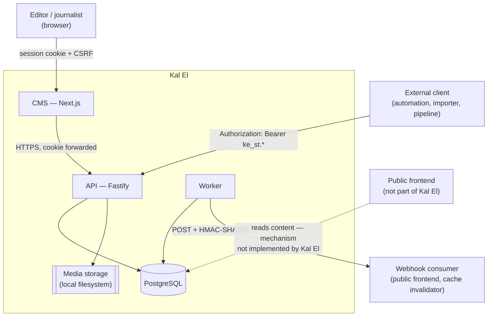
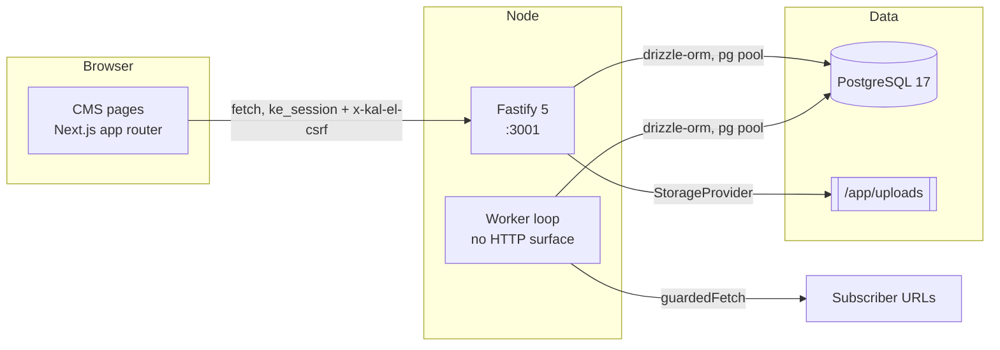
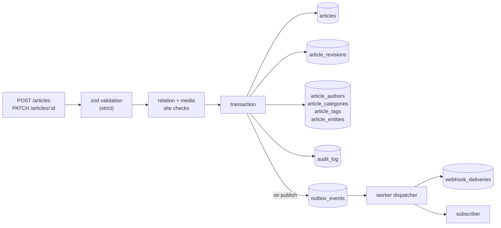
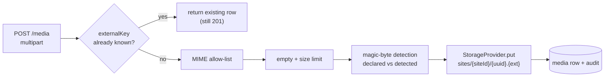

# Kal El — System Architecture

The real components, what each one owns, and how they talk.

```
Reviewed against:
BRANCH: claude/kal-el-visual-ux-final-ade7eb
HEAD:   5de5b28b4a2a7a1d86a8f7a12b1493d3c73200f0
DATE:   2026-08-19
```

---

## 1. System context



**The API is the only writer of record.** The CMS is a client of it. The worker is a
second process against the same database. No component writes editorial state except
through the API's services, and nothing outside Kal El should touch PostgreSQL directly.

---

## 2. Containers



| Component | Responsibility | Entry point | Depends on | Runtime |
|---|---|---|---|---|
| `apps/api` | the entire HTTP contract: auth, RBAC, validation, articles, media, taxonomy, SEO, preview, audit, admin | `apps/api/src/server.ts` | `@kal-el/db`, `@kal-el/contracts`, `@kal-el/auth`, `@kal-el/events` | Node ≥22, Fastify 5, port 3001 |
| `apps/cms` | the editorial interface; renders previews | Next.js app router | `@kal-el/design-system`, `@kal-el/editor`, `@kal-el/contracts` | Node ≥22, Next 14, port 3000 |
| `apps/worker` | promotes scheduled articles; drains the outbox to webhooks; maintenance | `apps/worker/src/worker.ts` | `@kal-el/db`, `@kal-el/contracts`, `@kal-el/events` | Node ≥22, no HTTP surface |
| `apps/fixture` | reference webhook consumer for the e2e suite | `apps/fixture/src/server.ts` | `@kal-el/events` | test only |
| `packages/contracts` | zod schemas for every request/response, error codes, OpenAPI registry | `src/index.ts` | zod | shared library |
| `packages/db` | drizzle schema, migrations, pool, logical backup/restore | `src/index.ts` | drizzle-orm, pg | shared library |
| `packages/auth` | password hashing, opaque token generation, effective-permission resolution | `src/index.ts` | drizzle-orm | shared library |
| `packages/events` | webhook signing and the four header constants | `src/index.ts` | node:crypto | shared library |
| `packages/editor` | Tiptap and Lexical bindings for the document schema | `src/index.ts` | `@kal-el/contracts` | browser library |
| `packages/design-system` | PEG React components and tokens | `src/index.ts` | react | browser library |
| `packages/importer` | HTML / WordPress / Payload → article document; batch import over the SDK | `src/index.ts` | `@kal-el/sdk`, `@kal-el/contracts` | **in-process library, no HTTP surface** |
| `packages/sdk` | TypeScript client for the API | `src/index.ts` | `@kal-el/contracts` | Node library |
| `packages/testkit` | embedded PostgreSQL and test helpers | `src/index.ts` | — | test only |

---

## 3. Request flow — an external client creating an article

```mermaid
sequenceDiagram
    autonumber
    participant C as External client
    participant F as Fastify
    participant AU as auth plugin
    participant G as guard(permission)
    participant S as services/articles
    participant D as PostgreSQL

    C->>F: POST /v1/sites/{siteId}/articles<br/>Authorization: Bearer ke_st.*<br/>Idempotency-Key
    F->>F: genReqId, rate limit (per token)
    F->>AU: onRequest — readCredentials
    AU-->>F: { kind: "service", token }
    F->>AU: preHandler — requireSiteScope(siteId)
    AU->>D: service_tokens by token hash
    D-->>AU: row
    AU->>AU: revoked? expired? siteId matches?
    AU->>D: update last_used_at
    AU-->>F: ActorContext { scopes }
    F->>G: guard("articles.create")
    G-->>F: ok (403 otherwise)
    F->>F: createArticleBodySchema.safeParse (strict)
    F->>F: publish/schedule scope escalation
    F->>S: withIdempotency(...)
    S->>D: BEGIN; advisory lock
    S->>D: existing key? -> replay
    S->>D: externalKey lookup -> return existing (200)
    S->>D: assert media / relations in site
    S->>D: INSERT article, revision 1, outbox?, audit
    S->>D: COMMIT
    S-->>F: { article, created }
    F-->>C: 201 (or 200) { data: {...} }
```

Every mutating request passes, in order: rate limit → credential resolution → site scope →
permission guard → zod validation → service logic in one transaction → audit row.

---

## 4. Authentication and authorisation

Two credentials, resolved by shape:

| | Session | Service token |
|---|---|---|
| Carrier | cookie `ke_session`, value `ke_s.…` | `Authorization: Bearer ke_st.…` |
| Storage | SHA-256 hash in `sessions.token_hash` | SHA-256 hash in `service_tokens.token_hash` |
| CSRF | **required** — `x-kal-el-csrf` on every non-GET/HEAD/OPTIONS | not applicable |
| Site binding | via `user_roles`, per site | **one site, in the token row** |
| Rights | union of role permissions **at that site** | the token's `scopes` array |
| Lifetime | TTL, idle timeout, absolute timeout, periodic rotation with a grace window | optional `expires_at`, revocable |
| Audit identity | `actor_type="user"`, `actor_id=users.id` | `actor_type="service"`, `actor_id=service_tokens.id` |

RBAC is deliberately flat: a route names one permission string, and the check is set
membership. Users get theirs from roles held **at the requested site**; tokens carry theirs
literally. There is no hierarchy, wildcard or implication.

Admin routes distinguish two modes: global routes take the union of the actor's permissions
across every site; `/sites/{siteId}/…` routes require the permission **at that site**,
so one site's owner cannot act on another's.

---

## 5. Multi-site

Every editorial table carries `site_id` with `ON DELETE CASCADE` to `sites`. Every
editorial route lives under `/v1/sites/{siteId}`. Cross-site references to authors,
categories, tags and entities are refused with the same message as a non-existent id, so
the API is not an existence oracle across tenants for taxonomy — **media is the exception**,
distinguishing "does not exist" from "does not belong to this site". See
[MULTISITE.md](MULTISITE.md) and [../KNOWN-ISSUES.md](../KNOWN-ISSUES.md).

---

## 6. Editorial data flow



Two invariants hold everything together:

1. **Version-guarded writes.** Every mutating `UPDATE` on an article carries
   `version = <the value read>` in its `WHERE`. A lost race is a `409 VERSION_CONFLICT`,
   never a silent overwrite. See [../api/CONCURRENCY.md](../api/CONCURRENCY.md).
2. **Transactional outbox.** The event row is inserted in the same transaction as the state
   change, keyed deterministically. An article cannot be published without its event, and
   an event cannot exist for a rolled-back publish. See
   [../integrations/WEBHOOKS.md](../integrations/WEBHOOKS.md).

---

## 7. The worker

One process, one `setInterval` at `POLL_INTERVAL_MS` (default 1000 ms). Each tick runs four
jobs, in this order, **each in its own `try`** so a failure in one does not skip the rest:

1. **Dispatcher** — claim up to `OUTBOX_BATCH_SIZE` due outbox rows with
   `FOR UPDATE SKIP LOCKED`, match enabled subscribers by site and event type, POST with an
   HMAC signature, and record per-`(hook, event)` retry state.
2. **Scheduler** — promote articles where `status='scheduled' AND scheduled_at <= now()`,
   oldest first, up to `SCHEDULER_BATCH_SIZE`. Served by a partial index. Each promotion is
   a guarded `UPDATE`, so concurrent workers cannot double-publish. An article whose
   document cannot be parsed is moved to `blocked` rather than left to jam the queue
   forever; a transient failure keeps its place.
3. **Idempotency purge** — delete every `idempotency_keys` row past `expires_at`.
4. **Heartbeat** — one row per role, which is the only way the API can tell a stopped
   worker from an empty queue.

The worker has no HTTP surface. Its liveness is reported by
`GET /v1/sites/{siteId}/ops-status`.

---

## 8. Media



`StorageProvider` is an interface with one implementation, `LocalStorageProvider`, writing
under `MEDIA_LOCAL_PATH`. Keys are generated by the service and re-validated defensively
against traversal. Bytes are served back through the API behind `media.read` — there is no
public URL and no CDN integration.

Deletion is refused while a `media` row is referenced by `featuredMediaId`,
`seo.socialImageMediaId`, an `image`/`gallery` document node, or an author avatar.

---

## 9. Preview

`POST /articles/{id}/preview` mints a stateless HMAC token —
`kpv.<base64url payload>.<hex signature>`, signed with `SESSION_SECRET`, valid 15 minutes.
`GET /v1/preview/{token}` is **unauthenticated**; the token is the credential, and the
response always carries `x-robots-tag: noindex, nofollow`. The human-readable renderer
lives in the CMS at `/preview/{token}` and fetches that JSON server-side.

Because the token is stateless, it cannot be revoked before it expires.

---

## 10. Boundaries of responsibility

| Kal El owns | Kal El does **not** own |
|---|---|
| Editorial storage, workflow and versioning | Rendering a public website |
| Authentication, RBAC, service tokens, audit | Public-facing caching or a CDN |
| Media storage and validation | Image transformation, resizing, `srcset` |
| SEO **metadata** and redirect records | Emitting meta tags, OG, JSON-LD, sitemaps, `robots.txt` |
| Scheduling and publication events | Reacting to them — that is the subscriber's job |
| A signed preview payload and a CMS renderer | Previewing in your own frontend's layout |
| The document JSON schema | Rendering that JSON to HTML |
| Content acquisition **contracts** | Content acquisition itself — scraping, feeds, AI writing |

A public frontend consumes Kal El; it is not part of it. Nothing in this repository serves
a reader-facing page.

---

## 11. Technology

| Concern | Choice |
|---|---|
| Runtime | Node ≥ 22, ESM |
| Package manager | pnpm 11.15.1 workspaces |
| HTTP | Fastify 5 |
| Validation | zod 3 — one schema set shared by API, CMS, SDK and importer |
| Database | PostgreSQL 16/17 via drizzle-orm 0.45 |
| Migrations | drizzle-kit, SQL files under `packages/db/drizzle` |
| CMS | Next.js 14 app router |
| Editor | Tiptap and Lexical bindings over one document schema |
| Logging | Pino (API), hand-rolled JSON (worker) |
| Tests | Vitest with embedded PostgreSQL; Playwright for e2e |

Relevant decision records live in [../adr/](../adr/) — monorepo tooling, drizzle, Fastify,
sessions vs tokens, idempotency + outbox, importers, the editor engine, document schema v2,
media storage, and the workflow state machine.

---

## Implementation references

- `apps/api/src/app.ts`, `apps/api/src/server.ts` — composition and boot
- `apps/api/src/plugins/` — `auth`, `db`, `errors`, `idempotency`, `audit`
- `apps/api/src/routes/` — `site`, `admin`, `auth`, `preview`, `health`
- `apps/api/src/services/` — the domain logic
- `apps/api/src/storage/` — the `StorageProvider` interface and local implementation
- `apps/worker/src/worker.ts`, `scheduler.ts`, `dispatcher.ts`, `safe-fetch.ts`, `ssrf.ts`
- `packages/contracts/src/` — the shared contract
- `packages/db/src/schema/` — the persistence model
- `packages/auth/src/rbac.ts` — effective permission resolution
