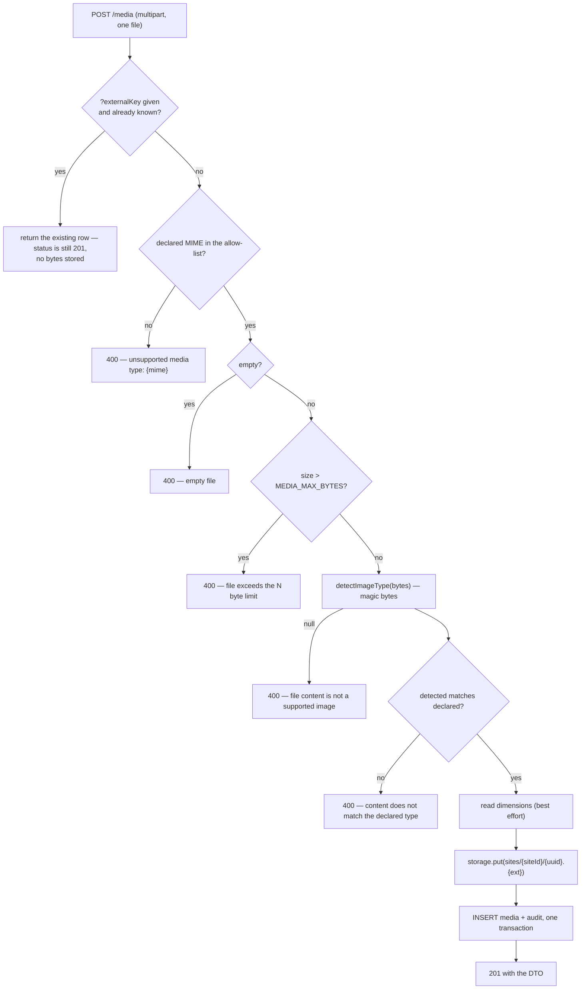

# Kal El — Media

Upload, validation, storage, referencing and deletion.

```
Reviewed against:
BRANCH: claude/kal-el-visual-ux-final-ade7eb
HEAD:   5de5b28b4a2a7a1d86a8f7a12b1493d3c73200f0
DATE:   2026-08-19
```

Request/response reference:
[../integrations/EXTERNAL_CLIENT_API.md §13](../integrations/EXTERNAL_CLIENT_API.md#13-media).
This document covers the model, the validation pipeline and the operational consequences.

---

## 1. The model

One table, `media`, site-scoped. Bytes live outside the database.

| Field | Type | Set by | Updatable |
|---|---|---|---|
| `id` | uuid | server | — |
| `siteId` | uuid | path | — |
| `filename` | string | **sanitised** from the upload | no |
| `mimeType` | string | **detected from the bytes**, not the header | no |
| `sizeBytes` | int | server | no |
| `width`, `height` | int or null | read from the bytes | no |
| `altText` | string ≤500, null | client | **yes** |
| `caption` | string ≤2000, null | client | **yes** |
| `credit` | string ≤500, null | client | **yes** |
| `focalX`, `focalY` | 0..1, null | client | **yes** |
| `storageKey` | string | server — `sites/{siteId}/{uuid}.{ext}` | no |
| `provider` | string | storage backend name (`local`) | no |
| `externalKey` | string ≤200, null | **query parameter on upload** | no |
| `createdBy` | uuid or null | the user; **null for a service-token upload** | — |
| `createdAt`, `updatedAt` | timestamp | server | — |
| `url` | string | **computed**, not stored — `API_BASE_URL` + the file route | — |

`url` appears in every response but is **not** in `mediaSchema`; it is added by the DTO
builder. Recorded in [../KNOWN-ISSUES.md](../KNOWN-ISSUES.md).

`filename` sanitisation: basename only (backslashes normalised first), `[^\w.\- ]` replaced
with `_`, whitespace collapsed to `_`, truncated to 120 chars, falling back to `"file"`.

---

## 2. The upload pipeline



Note the ordering: the `externalKey` check happens **first**, before any validation. A
repeat upload under a known key never re-reads or re-stores the bytes.

Note also that `413 PAYLOAD_TOO_LARGE` comes from the multipart layer when the stream
exceeds `MEDIA_MAX_BYTES`; the service's own size check produces a `400` for a buffer that
got through.

### Accepted formats

`image/jpeg`, `image/png`, `image/webp`, `image/gif`, `image/avif`.

**SVG is deliberately excluded** — it is an XSS surface, and these files are served from the
trusted API origin.

### Magic-byte detection

The declared `Content-Type` is a header the client writes and is never trusted.
`detectImageType` reads a handful of leading bytes:

| Format | Signature |
|---|---|
| JPEG | `FF D8 FF` |
| PNG | `89 50 4E 47 0D 0A 1A 0A` |
| GIF | ASCII `GIF87a` or `GIF89a` |
| WEBP | `RIFF` at 0 and `WEBP` at 8 |
| AVIF | `ftyp` at 4 with a brand in `avif`, `avis`, `mif1`, `miaf` |

Length is checked per format — a JPEG is identifiable from 3 bytes, WEBP needs 12 — so a
blanket minimum does not reject a small-but-valid file. **No decoder runs on untrusted
input.**

The stored `mimeType` is the **detected** one, and any declared/detected mismatch is a
`400` carrying both `details.declared` and `details.detected`.

> **`image/jpg` is rejected outright.** The allow-list is tested against the raw declared
> header *before* the bytes are inspected, and it contains only the five types above — so an
> upload declaring `image/jpg` fails with `400 unsupported media type: image/jpg`. The
> `image/jpg` → `image/jpeg` normalisation inside `typesMatch` runs only after that check
> and is therefore unreachable from the upload path.

Dimensions are read with `image-size` and swallow failures — `width`/`height` become `null`
rather than failing the upload.

---

## 3. Storage

```ts
interface StorageProvider {
  readonly name: string;
  put(input: { key: string; data: Buffer; mimeType: string }): Promise<void>;
  get(key: string): Promise<Buffer | null>;
  delete(key: string): Promise<void>;
}
```

One implementation: `LocalStorageProvider`, rooted at `MEDIA_LOCAL_PATH` (default
`./uploads`, `/app/uploads` in production, volume `kalel_media`).
`MEDIA_STORAGE_PROVIDER` is an enum whose **only accepted value is `local`** — there is no
S3/R2 implementation, only the interface for one.

Keys are generated by the service (`sites/{siteId}/{uuid}.{ext}`) and re-validated
defensively in the provider: a key that is absolute, contains `..`, a backslash or a NUL
byte is rejected.

### Consequences

| Consequence | Detail |
|---|---|
| **Multi-replica API needs a shared volume** | otherwise one replica 404s on the other's uploads |
| **No CDN** | bytes are served by the API at `GET /v1/sites/{siteId}/media/{mediaId}/file`, behind `media.read` |
| **`url` is not public** | a public frontend needs its own route to the bytes |
| **Deleting a row does not delete the file** | `deleteMedia` removes the row and writes an audit entry; the stored object is left behind. Reclaiming disk is an operator task. |
| **No transformation** | no resizing, no format conversion, no `srcset`; `focalX`/`focalY` are stored for a renderer to use, and nothing in Kal El reads them |

---

## 4. Deduplication

Only by `externalKey`, unique on `(siteId, externalKey)`.

| Upload | Result |
|---|---|
| With a **new** `externalKey` | stored, `201` |
| With a **known** `externalKey` | the existing row is returned, no bytes stored — **still `201`** |
| Without `externalKey`, same file twice | **two rows, two stored objects** |

There is no checksum column and no content-addressed deduplication. An automation client
that omits `externalKey` will accumulate a duplicate of every asset on every run — and
those duplicates are unreferenced, so they are not even reclaimable by the in-use guard.

**There is no lookup-by-externalKey endpoint for media.** You cannot ask whether an asset
already exists; you can only re-`POST` with the same key. That costs the bandwidth but
never stores a duplicate. Cache the `externalKey → mediaId` map in your own client.

---

## 5. Referencing

| Where | Field | Validated |
|---|---|---|
| Article hero | `featuredMediaId` | on create and update |
| Social card | `seo.socialImageMediaId` | on create and update |
| Document image | `{"type":"image","attrs":{"mediaId": "…"}}` | on create and update |
| Document gallery | `{"type":"gallery","attrs":{"mediaIds":[…]}}` | on create and update |
| Author portrait | `authors.avatarMediaId` | **not writable through the API** |

`collectDocumentMediaIds` walks the document's `image` and `gallery` nodes; every id from
every source is passed to `assertMediaInSite`, which fails with
`400 VALIDATION_ERROR` and `details.mediaId` for a missing id, and with a different message
for one belonging to another site.

**Documents never carry a URL.** Upload first, then reference the returned `id`.

### Per-placement vs per-asset text

An `image` node carries its own `altText`, `caption` and `credit`, independent of the media
record's. Neither overrides the other — the renderer chooses. The media record's values are
the defaults an editor sets once; the node's are the ones this placement needs.

---

## 6. Deletion and the in-use guard

`DELETE /v1/sites/{siteId}/media/{mediaId}` refuses with `409 CONFLICT` ("media is in use")
when, **within the same site**, the id appears as:

- `articles.featured_media_id`;
- `articles.seo ->> 'socialImageMediaId'`;
- an `image` node's `attrs.mediaId`, **or** an element of a `gallery` node's
  `attrs.mediaIds`;
- `authors.avatar_media_id`.

The document scan is a jsonb query over `document -> 'nodes'`, guarded by a
`jsonb_typeof(...) = 'array'` check so a malformed document cannot break it.

> This guard was previously a `LIKE` against `document::text` looking for
> `"mediaId":"<id>"`. PostgreSQL re-serialises jsonb on output **with a space** after the
> colon, so the pattern never matched anything and the guard could not fire — while the CMS
> grid deletes on one click with no confirmation. It also could not see galleries, whose
> attribute is an array called `mediaIds`, nor the social image in `seo`.

There is no force-delete and no cascade. Detach every reference first.

---

## 7. Listing

```
GET /v1/sites/{siteId}/media?q=&limit=60&offset=0
```

**Offset pagination**, unlike articles:

| Parameter | Default | Bounds |
|---|---|---|
| `limit` | 60 | clamped to 1..200 |
| `offset` | 0 | clamped to ≥0 |
| `q` | — | case-insensitive substring on **`filename` only** |

```json
{ "data": { "items": [ "..." ], "total": 1234 } }
```

`total` is a real `count(*)` — unlike the article list, which never sends one. Ordering is
`created_at DESC, id DESC`.

Search does not cover `altText`, `caption` or `credit`.

---

## 8. Idempotency on upload

`POST /media` honours `Idempotency-Key`. Because a multipart body is not in `req.body`, the
route passes the **SHA-256 of the uploaded bytes** as extra hash material.

Without it, two different files sent under one key would hash identically (same method,
same URL, empty body) and the second upload would silently replay the first's response —
discarding the second file while telling the caller it succeeded.

---

## 9. Limits

| Limit | Value | Source |
|---|---|---|
| Max file size | 25 MiB | `MEDIA_MAX_BYTES` |
| Files per request | **1** | `@fastify/multipart` `limits.files` |
| JSON body limit | 5 MiB | Fastify `bodyLimit` |
| Filename length | 120 chars after sanitisation | |
| `externalKey` | 200 chars in the response contract (`mediaSchema`) — **not enforced on upload**: the query parameter is unvalidated and the column is `text` | |
| `altText`, `credit` | 500 | |
| `caption` | 2000 | |
| `focalX`, `focalY` | 0..1 | |
| Gallery node | 1..50 media ids | |

---

## Implementation references

- `apps/api/src/services/media.ts` — upload, dedup, DTO, list, update, delete, `assertMediaInSite`, `collectDocumentMediaIds`
- `apps/api/src/services/image-signature.ts` — `detectImageType`, `typesMatch`
- `apps/api/src/storage/provider.ts`, `local.ts`, `index.ts` — the storage abstraction
- `apps/api/src/routes/site.ts` — the six media routes and the multipart handling
- `packages/contracts/src/media.ts` — `mediaSchema`, `updateMediaBodySchema`
- `packages/db/src/schema/media.ts` — the table and its indexes
- `apps/api/src/app.ts` — multipart registration and `MEDIA_MAX_BYTES`
