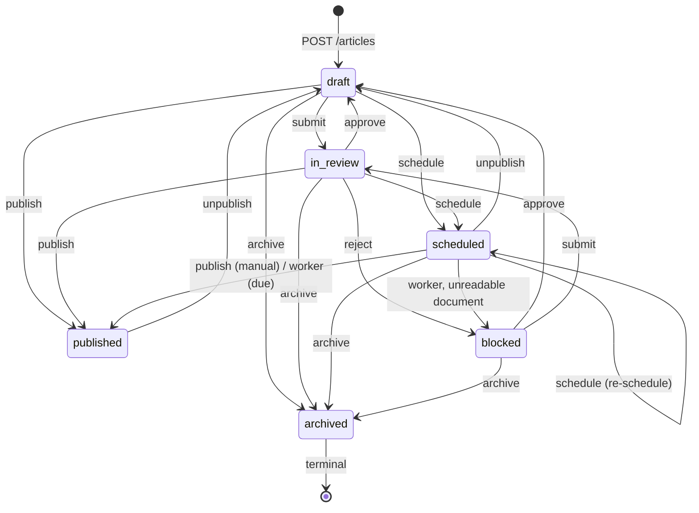

# Kal El — Editorial Workflow

The article state machine as implemented: states, legal transitions, endpoints,
permissions, side effects.

```
Reviewed against:
BRANCH: claude/kal-el-visual-ux-final-ade7eb
HEAD:   5de5b28b4a2a7a1d86a8f7a12b1493d3c73200f0
DATE:   2026-08-19
```

---

## 1. States

`articleStatusSchema` — six values, also a `text` column constrained to the same set:

| Status | Meaning |
|---|---|
| `draft` | being written; the default for a new article |
| `in_review` | submitted, awaiting an editor |
| `scheduled` | approved for publication at `scheduledAt`; the worker promotes it |
| `published` | live; `publishedAt` is set |
| `blocked` | rejected by an editor, **or** taken out of the scheduler by the worker because its body could not be read |
| `archived` | terminal; removed from circulation |

There is **no `approved` status.** Approval returns the article to `draft`; the durable
record of the approval is the `articles.approve` row in the audit log.

Deletion of an article is **not** exposed by any route. `archived` is how an article
leaves circulation. (The `articles.delete` permission exists but is checked nowhere.)

---

## 2. The state machine



The authoritative table, `WORKFLOW_TRANSITIONS` in `apps/api/src/services/articles.ts`:

| From | Allowed targets |
|---|---|
| `draft` | `in_review`, `scheduled`, `published`, `archived` |
| `in_review` | `draft`, `blocked`, `scheduled`, `published`, `archived` |
| `scheduled` | `published`, `scheduled`, `draft`, `archived` |
| `published` | `draft` |
| `blocked` | `in_review`, `draft`, `archived` |
| `archived` | **(none — terminal)** |

Anything outside this table is `409 INVALID_TRANSITION` with `details.from` and
`details.to`.

Consequences worth stating plainly:

- **`published` can only go to `draft`.** A live article cannot be archived or re-scheduled
  directly — unpublish it first.
- **`archived` is a dead end.** Nothing brings an archived article back through the API.
- **`submit` is not a prerequisite for publishing.** `draft -> published` is legal.
- **`scheduled -> scheduled` is legal**, which is what makes re-scheduling work.

---

## 3. Transitions

All seven live under `/v1/sites/{siteId}/articles/{articleId}`, are `POST`, return
**`200`** with the complete updated article in `{"data": ...}`, and honour
`Idempotency-Key`.

### submit

| | |
|---|---|
| Endpoint | `POST .../submit` |
| Permission | `articles.submit` |
| Source states | `draft`, `blocked` |
| Target | `in_review` |
| Body | `{"note": "optional, <=500"}` (`.strict()`) |
| Idempotency-Key | honoured |
| Retry-safe without a key | **yes** — re-submitting an `in_review` article is a no-op `200` |
| Side effects | `version + 1`; audit `articles.submit` with `details.from`/`to`/`note` |
| Dates | `publishedAt` / `scheduledAt` untouched |

### approve

| | |
|---|---|
| Endpoint | `POST .../approve` |
| Permission | `articles.approve` |
| Source states | **`in_review` or `blocked` only** |
| Target | `draft` |
| Body | `{"note": "optional"}` |
| Idempotency-Key | honoured |
| Retry-safe without a key | **NO — replaying it on an article already in `draft` is `409 INVALID_TRANSITION`. Always send a key.** |
| Side effects | `version + 1`; **clears `publishedAt` and `scheduledAt`**; audit `articles.approve` |

Approving from any other state is `409 INVALID_TRANSITION` with
`details.expected = ["in_review","blocked"]`.

> The `APPROVABLE_FROM` restriction exists for a security reason. `approve` and `unpublish`
> both target `draft`, and `published -> draft` is a legal transition. Without it, an
> editor holding `articles.approve` but deliberately **not** `articles.publish` could
> withdraw a live article through `/approve` — and the date-clearing would destroy its
> original `publishedAt` irrecoverably.

### reject

| | |
|---|---|
| Endpoint | `POST .../reject` |
| Permission | **`articles.approve`** — there is no `articles.reject` |
| Source states | `in_review` |
| Target | `blocked` |
| Body | `{"note": "optional"}` |
| Retry-safe without a key | **yes** — no-op on an already-`blocked` article |
| Side effects | `version + 1`; **clears `publishedAt` and `scheduledAt`**; audit `articles.reject` |

### schedule

| | |
|---|---|
| Endpoint | `POST .../schedule` |
| Permission | `articles.schedule` |
| Source states | `draft`, `in_review`, `scheduled` |
| Target | `scheduled` |
| Body | `{"scheduledAt": "<RFC 3339 with offset>", "note": "optional"}` (`.strict()`, `scheduledAt` required) |
| Preconditions | `scheduledAt` must be **strictly in the future** → `409 CONFLICT` ("scheduledAt must be in the future") |
| Retry-safe without a key | no — it re-writes `scheduledAt` each time (harmless, but not a no-op) |
| Side effects | `version + 1`; sets `scheduledAt`; **sets `publishedAt` to `null`**; audit `articles.schedule` |

### publish

| | |
|---|---|
| Endpoint | `POST .../publish` |
| Permission | `articles.publish` |
| Source states | `draft`, `in_review`, `scheduled` |
| Target | `published` |
| Body | `{"note": "optional"}` |
| Preconditions | the stored document must be **readable** → otherwise `409 CONFLICT` ("the stored document cannot be read; fix the article body before publishing") with `details.field = "document"` |
| Retry-safe without a key | **yes** — an article already `published` with a `publishedAt` is returned unchanged, no version bump |
| Side effects | `version + 1`; `publishedAt = existing ?? now`; **`scheduledAt = null`**; new revision with the note (default `"published"`); **outbox event `article.published`**; audit `articles.publish` |

The outbox row is keyed `article:<id>:publish:<publishedAt epoch ms>` with
`ON CONFLICT DO NOTHING` — republishing at the same instant cannot emit twice.

### unpublish

| | |
|---|---|
| Endpoint | `POST .../unpublish` |
| Permission | `articles.publish` |
| Source states | `published`, `scheduled`, and any state whose table lists `draft` |
| Target | `draft` |
| Body | `{"note": "optional"}` |
| Retry-safe without a key | **NO — replaying it on an article already in `draft` is `409 INVALID_TRANSITION`. Always send a key.** |
| Side effects | `version + 1`; **clears `publishedAt` and `scheduledAt`**; audit `articles.unpublish` |

No event is emitted on unpublish. A consumer that cached a published article will not be
told it is gone — poll, or reconcile.

### archive

| | |
|---|---|
| Endpoint | `POST .../archive` |
| Permission | `articles.publish` |
| Source states | `draft`, `in_review`, `scheduled`, `blocked` — **not `published`** |
| Target | `archived` |
| Body | `{"note": "optional"}` |
| Retry-safe without a key | **yes** — no-op on an already-archived article |
| Side effects | `version + 1`; clears both dates; audit `articles.archive`; terminal |

---

## 4. Retry safety, precisely

Before checking the transition table, `applyStatusTransition` returns the article unchanged
when it is already in the target state — **except** when the target is `draft`:

```
AMBIGUOUS_TARGET = ["draft"]
if (current === target && !AMBIGUOUS_TARGET.includes(target)) return article   // no-op 200
```

| Endpoint | Target | Re-send on an article already there |
|---|---|---|
| `submit` | `in_review` | **no-op `200`** |
| `reject` | `blocked` | **no-op `200`** |
| `archive` | `archived` | **no-op `200`** |
| `publish` | `published` | **no-op `200`** (guarded separately, requires `publishedAt` set) |
| `schedule` | `scheduled` | re-applies, writing the new `scheduledAt` |
| `approve` | `draft` | **`409 INVALID_TRANSITION`** unless currently `in_review`/`blocked` |
| `unpublish` | `draft` | **`409 INVALID_TRANSITION`** — `draft -> draft` is not in the table |

`draft` is excluded because it is the target of both `approve` and `unpublish`. Treating
status equality as a retry there would turn `approve` on an article that was never
submitted into a silent `200` with no audit row — the editorial gate becoming a no-op while
the caller was told it had approved.

The consequence for a client is concrete: **re-sending `approve` or `unpublish` on an
article that is already `draft` answers `409 INVALID_TRANSITION`, not `200`.** Neither
re-applies, and neither clears the dates a second time.

**Therefore: always send an `Idempotency-Key` on `approve` and `unpublish`.** That is what
makes those two safe to retry after a lost response.

---

## 5. Concurrency

Every transition is a version-guarded `UPDATE`. If another actor commits between this
request's read and its write, the update matches nothing and the response is
**`409 VERSION_CONFLICT`** with `details.expectedVersion`, `details.currentVersion` and
`details.currentStatus`.

This is a lost race, not a retry: re-read the article and decide whether the action still
makes sense. The no-op described in §4 happens *before* the `UPDATE` and never contends.

Note the transitions do **not** accept `If-Match` — the guard is internal and unconditional.
Full detail: [../api/CONCURRENCY.md](../api/CONCURRENCY.md).

---

## 6. Creating directly into a state

`POST /articles` may set `status` (and `publishedAt` / `scheduledAt`) directly, for
imports and backfills. This bypasses the transition table — a created article has no prior
state — but not the permissions:

| Body | Extra permission | Extra rule |
|---|---|---|
| `status: "published"` or a non-null `publishedAt` | `articles.publish` | **only when `status` is `published`** does `publishedAt` default to *now* and an `article.published` outbox event get emitted. A `publishedAt` sent with any other status costs the permission, is stored verbatim, and emits nothing. |
| `status: "scheduled"` or a non-null `scheduledAt` | `articles.schedule` | **`scheduledAt` is mandatory** → `400 VALIDATION_ERROR`, `details.field = "scheduledAt"` |

The mandatory `scheduledAt` matters: the worker's due query is
`status = 'scheduled' AND scheduled_at <= now()`, and `<=` against `NULL` is `NULL`. An
article created as `scheduled` with no time would sit in the queue state forever, never
publish, and nothing would report it.

A `scheduledAt` in the **past** on create is accepted and means "publish on the next worker
tick". If that is not what you want, do not send a past date.

---

## 7. The worker

`promoteScheduledArticles` runs every tick (`POLL_INTERVAL_MS`, default 1000 ms):

```
SELECT id FROM articles
 WHERE status = 'scheduled' AND scheduled_at <= now()
 ORDER BY scheduled_at ASC
 LIMIT 100
```

served by the partial index `articles_scheduled_due_idx`. For each article:

1. Guarded `UPDATE` to `published`, `version + 1` — at most one worker wins.
2. A revision is filed with the promoted document.
3. An `article.published` outbox event is inserted, keyed deterministically.
4. An audit row is written with `actor_type = "worker"` and
   `actor_label = "Scheduler (worker)"`.

**Failure handling is split by kind:**

| Failure | Outcome |
|---|---|
| The document cannot be parsed (`UnpublishableArticle`) | the article is moved to **`blocked`** with `version + 1`, taken out of the due window, and surfaced to editors |
| Anything else (connection reset, failover, statement timeout) | the article keeps its place in the queue and is retried next tick |

An article moved to `blocked` this way carries `document_unreadable` in `qualityFlags`.
It appears in `GET /ops-status` under `articles.blocked`.

---

## 8. Quality flags

`qualityFlags` is a server-computed array on every article read.

| Flag | Meaning |
|---|---|
| `document_unreadable` | the stored `document` column does not parse as a valid article document |

Every reader degrades such a document to `{"version":2,"nodes":[]}` so the row stays
reachable and editable. **A client must check this flag before writing a document back** —
writing the degraded value over the original destroys the only copy of the real bytes.

Recovery is a separate, permission-gated path (`articles.recover`):

| Method | Path | Purpose |
|---|---|---|
| GET | `.../document/raw` | the exact column contents, why it failed to parse, and which revisions are also unreadable |
| GET | `.../revisions/{revisionId}/raw` | the raw bytes of one revision |
| POST | `.../document/replace` | preserve the current bytes as a revision, then write a valid replacement |

`document/replace` takes `{"document": ..., "note": "optional"}`, honours `If-Match` and
`Idempotency-Key`, and refuses a replacement that is itself invalid with
`400 VALIDATION_ERROR`. It returns `{articleId, version, preservedAs, document}` — where
`preservedAs` is the revision number the old bytes were filed under.

---

## 9. Revisions

`article_revisions` is append-only, unique on `(article_id, revision_number)`, numbered
from 1.

| Event | Revision written | Note |
|---|---|---|
| Create | yes, number 1 | `"created"` |
| `PATCH` **with** a `document` that actually differs | yes | `"updated"` |
| `PATCH` **with** a `document` when the stored one was unreadable | **two**: the raw bytes first, then the new document | `"documento anterior ilegivel (preservado)"`, then `"updated"` |
| `PATCH` without `document`, or with an identical one | **no** | — |
| `publish` | yes | the request's `note`, or `"published"` |
| Worker promotion | yes | `"scheduled publish"` |
| `document/replace` | **two**: the old bytes, then the replacement | preservation note, then the replacement note |
| `submit` / `approve` / `reject` / `schedule` / `unpublish` / `archive` | **no** | — |

```
GET /v1/sites/{siteId}/articles/{articleId}/revisions      (scope: articles.read)
```

returns the complete list, newest first, each `{id, articleId, revisionNumber, document,
createdBy, note, createdAt}`. There is no pagination and **no endpoint that restores a
revision** — restoring means reading a revision and `PATCH`ing its document back.

---

## 10. Permission map

| Endpoint | Permission | Typical holder |
|---|---|---|
| `POST /articles` | `articles.create` | writer, importer |
| `PATCH /articles/{id}` | `articles.update` | writer (own articles only, if unprivileged) |
| `POST .../submit` | `articles.submit` | writer |
| `POST .../approve` | `articles.approve` | editor |
| `POST .../reject` | `articles.approve` | editor |
| `POST .../schedule` | `articles.schedule` | chief editor |
| `POST .../publish` | `articles.publish` | chief editor |
| `POST .../unpublish` | `articles.publish` | chief editor |
| `POST .../archive` | `articles.publish` | chief editor |
| `.../document/raw`, `.../document/replace` | `articles.recover` | owner / admin / chief editor — deliberately not a writer |

A client's scopes define how far it can carry an article. An automation with
`articles.create` + `articles.submit` legitimately stops at `in_review` and hands over to a
human. Check `GET /v1/auth/me` at startup and plan the run around what you actually hold.

---

## 11. Events emitted

Only one event type is ever written to the outbox, from three call sites:

| Source | Event |
|---|---|
| `createArticle` with `status: "published"` | `article.published` |
| `publishArticle` | `article.published` |
| Worker promotion of a scheduled article | `article.published` |

Payload:

```json
{ "articleId": "<uuid>", "slug": "<slug or null>", "publishedAt": "<ISO 8601>", "version": <int> }
```

`article.updated` and `article.scheduled` exist in the subscribable enum but **nothing
emits them**. See [../integrations/WEBHOOKS.md](../integrations/WEBHOOKS.md) and
[../KNOWN-ISSUES.md](../KNOWN-ISSUES.md).

---

## Implementation references

- `apps/api/src/services/articles.ts` — `WORKFLOW_TRANSITIONS`, `assertTransition`,
  `applyStatusTransition`, `AMBIGUOUS_TARGET`, `APPROVABLE_FROM`, `publishArticle`,
  `scheduleArticle`, `concurrentChange`
- `apps/api/src/routes/site.ts` — the seven transition routes and their guards
- `apps/api/src/services/recovery.ts` — `readRawDocument`, `readRawRevision`, `replaceDocument`
- `apps/worker/src/scheduler.ts` — `promoteScheduledArticles`, `blockArticle`, `UnpublishableArticle`
- `packages/contracts/src/editorial.ts` — `articleStatusSchema`, `publishArticleBodySchema`,
  `scheduleArticleBodySchema`, `replaceDocumentBodySchema`, `QUALITY_FLAGS`
- `packages/db/src/schema/editorial.ts` — `articles.status`, `article_revisions`
