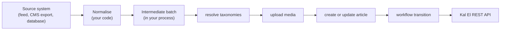
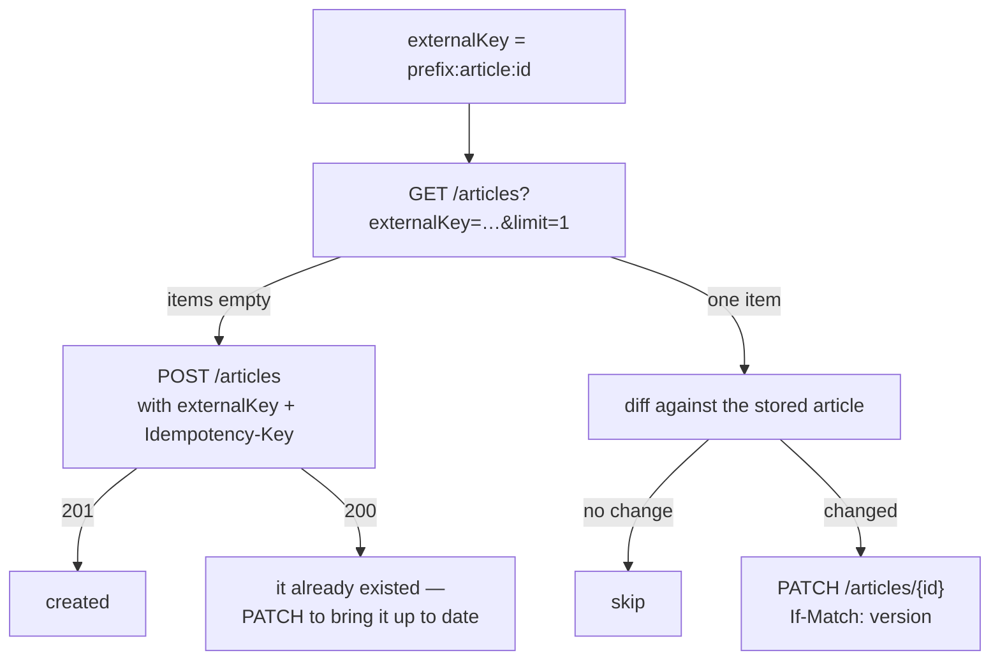

# Kal El — Content Ingestion Contract

How an external system should represent content **before** turning it into Kal El API
requests.

```
Reviewed against:
BRANCH: claude/kal-el-visual-ux-final-ade7eb
HEAD:   5de5b28b4a2a7a1d86a8f7a12b1493d3c73200f0
DATE:   2026-08-19
```

---

## 1. The honest answer first

> **There is no canonical ingestion DTO exposed over HTTP.**
>
> Kal El has no `/import` endpoint, no batch endpoint and no ingestion envelope. The only
> HTTP-reachable ingestion contract is the ordinary REST API:
> `POST /v1/sites/{siteId}/articles` (`createArticleBodySchema`),
> `PATCH /v1/sites/{siteId}/articles/{articleId}` (`updateArticleBodySchema`),
> `POST /v1/sites/{siteId}/media`, and the taxonomy routes.

A package called `@kal-el/importer` does exist and does define a neutral content model —
but:

- it is `private: true`, has no `bin`, and **no route anywhere imports it**;
- its models are **compile-time TypeScript types only** — no zod schema, no runtime
  validation, no serialisation format;
- it drives ingestion by calling the same public REST API through `@kal-el/sdk`.

So it is an **in-process library**, not a service and not a wire contract. Its shape is
still the best available reference for *how to organise your own data before calling the
API*, and this document sets it out — clearly labelled as a **design pattern you implement
in your client**, not an entity that exists at runtime.

This document therefore does two things:

1. describes the recommended intermediate shape (§3), modelled on the importer's own; and
2. gives the **exact mapping** from that shape to the real API requests (§4), which is the
   only part that is contractual.

---

## 2. Why an intermediate shape at all

The API is field-precise and order-dependent: taxonomies must exist before an article can
reference them, media must be uploaded before a document can embed it, and article identity
must be decided before you know whether to `POST` or `PATCH`. Normalising your source into
one flat structure first means the request-building stage has no decisions left to make and
can be retried as a unit.



---

## 3. Recommended intermediate model

Modelled on `packages/importer/src/types.ts`. **This is a pattern for your client, not a
runtime entity in Kal El.**

### Batch

| Field | Type | Notes |
|---|---|---|
| `sourceName` | string | identifies the origin system; becomes `provenance.system` |
| `categories` | Taxonomy[] | |
| `tags` | Taxonomy[] | |
| `authors` | Author[] | |
| `media` | Media[] | |
| `articles` | Article[] | |
| `redirects` | Redirect[] | optional; maps to `POST /redirects` |
| `warnings` | string[] | non-fatal normalisation problems worth logging |

### Article

| Field | Type | Required | Maps to |
|---|---|---|---|
| `externalId` | string | **yes** | `externalKey` (after prefixing) |
| `title` | string | **yes** | `title` |
| `slug` | string | recommended | `slug` — omit to let the server derive one |
| `type` | enum | no | `type` — `article` \| `review` \| `list` \| `video` \| `audio` |
| `dek` | string | no | `dek` |
| `excerpt` | string | no | `excerpt` |
| `bodyNodes` | node[] | **yes** | `document.nodes` |
| `status` | enum | no | `status` on create — **scope-gated** |
| `publishedAt` | RFC 3339 | no | `publishedAt` — scope-gated |
| `scheduledAt` | RFC 3339 | no | `scheduledAt` — scope-gated, **mandatory if `status = "scheduled"`** |
| `authorExternalIds` | string[] | no | resolved to `authors: [uuid]` |
| `categoryExternalIds` | string[] | no | resolved to `categories: [uuid]` |
| `tagExternalIds` | string[] | no | resolved to `tags: [uuid]` |
| `entityExternalIds` | string[] | no | resolved to `entities: [uuid]` |
| `featuredMediaExternalId` | string | no | resolved to `featuredMediaId` |
| `seo` | partial SEO | no | `seo` |
| `externalUrl` | string | no | `provenance.sources[].externalUrl` |

### Taxonomy / Author / Media / Redirect

| Type | Fields |
|---|---|
| Taxonomy | `externalId`, `kind` (`category` \| `tag`), `name`, `slug`, `parentExternalId?` |
| Author | `externalId`, `name`, `slug`, `email?` |
| Media | `externalId`, `filename`, `url` (in the **source** system), `mimeType`, `width?`, `height?`, `altText?`, `caption?` |
| Redirect | `sourcePath`, `targetPath` |

---

## 4. Mapping to the API — the contractual part

### 4.1 External identity

| Concept | Value sent |
|---|---|
| Article | `externalKey = "{prefix}:article:{externalId}"` |
| Media | `?externalKey={prefix}:media:{externalId}` |
| Taxonomies | **no external identity exists** — resolve by `slug` |

Kal El's own importer uses the prefix `imp`, producing e.g. `imp:article:wp:post:42`.
Include the *kind* in the key: without it, source article 123 and source media 123 collapse
onto the same string.

| Property | Article `externalKey` | Media `externalKey` |
|---|---|---|
| Column | `articles.external_key` | `media.external_key` |
| Unique on | `(site_id, external_key)` | `(site_id, external_key)` |
| Max length | 256 | 200 |
| Accepted on create | yes | yes, as a **query parameter** |
| Accepted on update | **no** — `PATCH` rejects it | not updatable |
| Duplicate create | returns the existing article with **`200`** | returns the existing media, still **`201`** |
| Filterable | `GET /articles?externalKey=…` | **no filter exists** |

> **Media has no lookup-by-externalKey endpoint.** You cannot ask "do I already have this
> asset?" — you can only re-`POST` with the same key and let the server return the existing
> row. That costs the upload bandwidth but never stores a duplicate. Cache the mapping in
> your own client to avoid re-sending bytes. Recorded in
> [../KNOWN-ISSUES.md](../KNOWN-ISSUES.md).

### 4.2 Field-by-field mapping

| Intermediate | API field | Endpoint | Notes |
|---|---|---|---|
| `externalId` | `externalKey` | create only | prefix it; create-only |
| `title` | `title` | create + update | the only required field |
| `slug` | `slug` | create + update | omit to auto-derive; changing it writes a 301 |
| `dek` | `dek` | create + update | |
| `excerpt` | `excerpt` | create + update | |
| `bodyNodes` | `document` | create + update | wrap as `{"version": 2, "nodes": [...]}` |
| `seo` | `seo` | create + update | shallow-merged on update |
| `type` | `type` | create + update | |
| `status` | `status` | **create only** | needs `articles.publish` / `articles.schedule` |
| `publishedAt` | `publishedAt` | **create only** | |
| `scheduledAt` | `scheduledAt` | **create only** | mandatory when `status = "scheduled"` |
| `authorExternalIds` | `authors` | create + update | array of Kal El uuids, **ordered** |
| `categoryExternalIds` | `categories` | create + update | array of uuids |
| `tagExternalIds` | `tags` | create + update | array of uuids |
| `entityExternalIds` | `entities` | create + update | array of uuids |
| `featuredMediaExternalId` | `featuredMediaId` | create + update | uuid |
| `sourceName` + `externalUrl` | `provenance` | create + update | metadata only; does **not** deduplicate |
| — | **`sources`** | — | **no such article field exists** |

Relation arrays **replace** the whole set on update. Send `[]` to clear; omit to leave
alone.

### 4.3 What has no home in the API

| Intermediate concept | Reality |
|---|---|
| Article ↔ source-entity link | **No `article_sources` table and no `sources` field.** Attribution goes in a `source` **document node**, which is free text. |
| Category hierarchy from a source | `createCategoryBodySchema` accepts `parentId`, but you must resolve the parent's Kal El uuid first — parents before children. (Kal El's own importer drops hierarchy entirely.) |
| Taxonomy external ids | Not stored. Resolution is by slug, so slugs must be stable across runs. |
| Entity external references | `entities.externalRefs` exists but is **not** a uniqueness key and is not used for lookup. |
| User accounts from a source | Not importable. `authors` are bylines; linking one to an account needs `roles.manage`. |
| Article-level `position`/ordering | Not modelled. Only `article_authors.position` (byline order) exists. |

---

## 5. Order of operations

The dependency order is not negotiable.

```
1. sites            already exists — you are given a siteId
2. categories       find-or-create by slug; parents before children
3. tags             find-or-create by slug
4. authors          find-or-create by slug
5. entities         create if used (no slug uniqueness — use an Idempotency-Key)
6. media            upload with ?externalKey; keep {externalId -> mediaId}
7. articles         create (with externalKey) or update (with If-Match)
8. relations        sent inside the same article body
9. workflow         submit / schedule / publish, as scopes allow
10. redirects       optional; slug changes create their own automatically
```

Steps 2–5 are **find-or-create by slug** because no taxonomy endpoint takes an external id:

```
GET /v1/sites/{siteId}/categories        -> build {slug: id}
missing? POST /v1/sites/{siteId}/categories with an Idempotency-Key
```

`categories`, `tags` and `authors` have a `(siteId, slug)` unique index, so a race produces
`409 CONFLICT` and you can re-read. **`entities` and `sources` have none** — a race there
inserts a duplicate unless every create carries an `Idempotency-Key`.

---

## 6. Create-versus-update



The `200` branch is real: two concurrent runs, or a retry after a lost response, will hit
it. **Creating with an existing `externalKey` does not update the article** — it returns it
unchanged. A synchronising client must follow with a `PATCH`.

A cheap change detector: hash the fields you own (title, slug, dek, excerpt, document, seo,
relation id lists) and store the hash against the `externalKey` in your own state. Skip the
`PATCH` when it matches. Kal El's own importer does exactly this, field by field.

---

## 7. Document construction

The body must be a valid v2 document. Full schema:
[../editor/ARTICLE_DOCUMENT.md](../editor/ARTICLE_DOCUMENT.md).

The two rules that catch every new client:

1. **Images carry `mediaId`, never a URL.** Upload first, substitute the returned id.
2. **`<h1>` is not a document node.** Map it to the article `title`; headings are 2–4.

If your source is HTML, `packages/importer/src/html.ts` is a working reference for the tag
mapping — but the conversion has to happen in your client, since the API accepts only the
JSON.

---

## 8. Status and provenance

| You want | Send |
|---|---|
| Land as a draft for a human | nothing — `draft` is the default |
| Land in review | create, then `POST .../submit` |
| Backfill an already-published archive | `status: "published"` + the original `publishedAt` (needs `articles.publish`) |
| Schedule for later | `status: "scheduled"` + a future `scheduledAt` (needs `articles.schedule`), or create as draft then `POST .../schedule` |
| Record where it came from | `provenance` |

A past `scheduledAt` means "publish on the next worker tick" — the worker will do exactly
that. If that is not what you want, do not send a past date. (Kal El's own importer maps
an already-expired schedule to `blocked` instead of publishing it.)

`provenance` is **descriptive only**. It never affects deduplication, ordering or workflow.
Only `externalKey` deduplicates.

---

## 9. Reference: the minimum viable ingestion request

```json
POST /v1/sites/{siteId}/articles
Idempotency-Key: <8..128 chars of [A-Za-z0-9._-]>

{
  "title": "The only required field",
  "externalKey": "my-pipeline:article:12345"
}
```

Everything else is optional. That request creates a draft with an auto-derived slug, an
empty document, and default SEO — and is idempotent and re-runnable forever.

---

## Implementation references

- `packages/contracts/src/editorial.ts` — `createArticleBodySchema`, `updateArticleBodySchema`, `provenanceSchema`
- `apps/api/src/services/articles.ts` — the `externalKey` lookup and create/update semantics
- `apps/api/src/services/media.ts` — `externalKey` reuse on upload
- `apps/api/src/services/taxonomy.ts` — the five taxonomies and their uniqueness
- `packages/importer/src/types.ts` — the neutral model this document is modelled on
- `packages/importer/src/import.ts` — find-or-create, diff-and-patch, `safeSchedule`
- `packages/importer/src/html.ts` — HTML → document nodes
- `packages/importer/src/reconcile.ts`, `dryrun.ts` — comparison and preview
