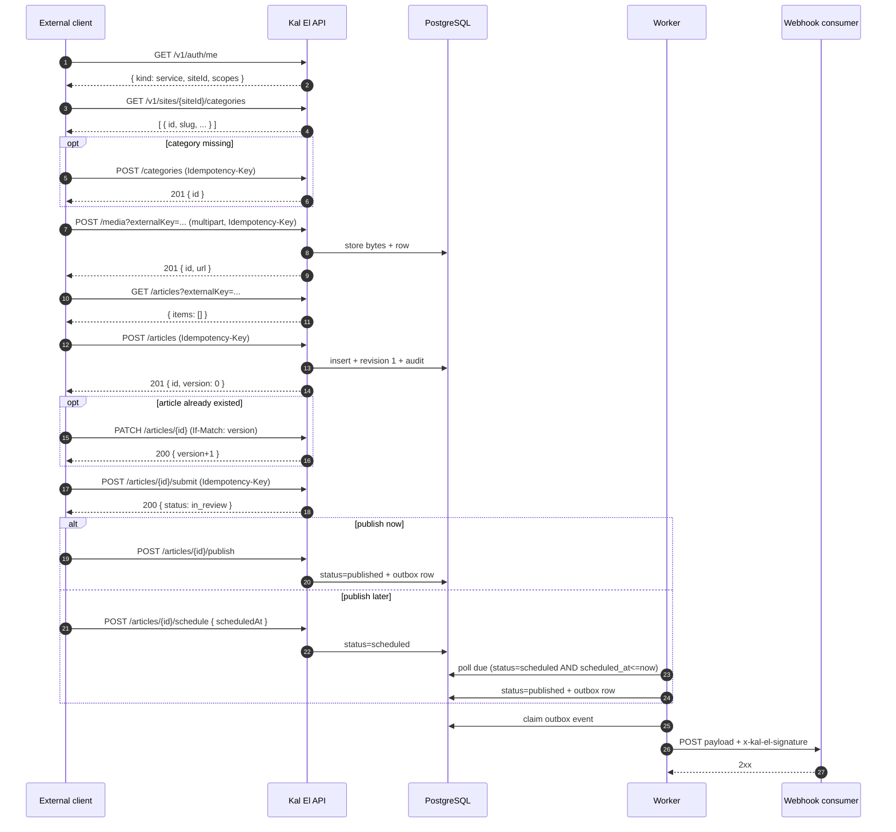

# Kal El — External Client API

The complete contract for a program that is **not** the Kal El CMS and writes editorial
content into Kal El over HTTP.

```
Reviewed against:
BRANCH: claude/kal-el-visual-ux-final-ade7eb
HEAD:   5de5b28b4a2a7a1d86a8f7a12b1493d3c73200f0
DATE:   2026-08-19
```

This document is written so that a client — in Python or anything else — can be
implemented **without reading the Kal El source**. Every path, field name, header, status
code and string literal below was read out of the implementation at the commit above.
Where the code and older documentation disagreed, the code won.

> Never connect an external client to PostgreSQL directly. Every guarantee described here
> — site scoping, version guarding, idempotency, the audit trail, outbox events — lives in
> the API layer.

**Related documents**

| Topic | Document |
|---|---|
| Every machine-readable error code | [../api/ERRORS.md](../api/ERRORS.md) |
| Idempotency and safe retries | [../api/IDEMPOTENCY.md](../api/IDEMPOTENCY.md) |
| Versioning and lost-update protection | [../api/CONCURRENCY.md](../api/CONCURRENCY.md) |
| The editorial state machine | [../editor/WORKFLOW.md](../editor/WORKFLOW.md) |
| The article body JSON schema | [../editor/ARTICLE_DOCUMENT.md](../editor/ARTICLE_DOCUMENT.md) |
| A runnable Python client | [PYTHON_CLIENT_EXAMPLE.md](PYTHON_CLIENT_EXAMPLE.md) |
| How to shape content before calling the API | [CONTENT-INGESTION-CONTRACT.md](CONTENT-INGESTION-CONTRACT.md) |
| Outbound events | [WEBHOOKS.md](WEBHOOKS.md) |

---

## 1. Base URL and versioning

Every editorial, admin, auth and preview route is prefixed with `/v1`. The liveness and
readiness probes are additionally served unprefixed (`/health`, `/ready`), and Swagger UI
lives at `/docs`. There is no content negotiation and no other API version. The base URL is whatever host the API process is exposed on; the API's own
notion of itself is the `API_BASE_URL` environment variable, which it uses to build
absolute media URLs.

```
POST https://api.example.com/v1/sites/{siteId}/articles
```

Request and response bodies are JSON, except media upload (`multipart/form-data`) and
media download (the stored image bytes).

**Global request body limit: 5 MiB** (`bodyLimit` in `apps/api/src/app.ts`). Media uploads
are bounded separately by `MEDIA_MAX_BYTES` (default 25 MiB).

---

## 2. Response envelope

Every successful JSON response **from a `/v1` route** is wrapped in a single-key envelope:

```json
{ "data": { "...": "..." } }
```

Every error response uses:

```json
{ "error": { "code": "VALIDATION_ERROR", "message": "validation failed", "details": { "requestId": "..." } } }
```

There is **no** top-level `success`, `status` or `created` field. When the distinction
between "created now" and "already existed" matters, it is carried by the **HTTP status
code only** — see [§7 External identity](#7-external-identity-externalkey).

The unversioned probes are the only exception to the envelope: `/health` and `/ready`
answer with a bare `{"status":"ok"}` / `{"status":"ready"}`.

A request to a path with **no matching route** does not go through the API's error handler
at all — it gets Fastify's built-in 404, whose `error` field is a plain string. See
[../api/ERRORS.md §1](../api/ERRORS.md#1-the-error-envelope).

---

## 3. Authentication

Two credentials exist, and an external client uses exactly one of them.

| Credential | How it travels | Who uses it | CSRF |
|---|---|---|---|
| **Service token** | `Authorization: Bearer ke_st.<secret>` | external clients, pipelines, automation | not applicable |
| Session cookie | `Cookie: ke_session=ke_s.<secret>` | the CMS in a browser | **required**: `x-kal-el-csrf` header on every non-GET/HEAD/OPTIONS request |

The credential is selected by shape, in `readCredentials()`:

- a `ke_session` cookie whose value starts with `ke_s.` → session credential;
- otherwise an `Authorization` header starting with `Bearer ` whose token starts with
  `ke_st.` → service credential;
- otherwise no credential at all.

A `Bearer` token that does **not** start with `ke_st.` is treated as *no credential* and
produces `401 UNAUTHENTICATED`.

**An external client sends exactly one header:**

```
Authorization: Bearer ke_st.<secret>
```

Do not send `x-kal-el-csrf` — CSRF is a browser-session concern and is never evaluated for
a service token.

### Checking a credential

```
GET /v1/auth/me
```

Works with either credential. For a service token it returns the token's own identity and
its full scope list — the cheapest way for a client to verify its configuration at
startup:

```json
{ "data": { "kind": "service", "id": "<uuid>", "name": "Importer X", "siteId": "<uuid>", "scopes": ["articles.create", "..."] } }
```

Revocation and expiry are enforced here too: a revoked token gets `403 FORBIDDEN`, an
expired one `401 UNAUTHENTICATED`.

---

## 4. Service tokens

### Format and storage

| Property | Value |
|---|---|
| Literal prefix | `ke_st.` |
| Body | 32 random bytes, base64url — `generateOpaqueToken()` |
| Full shape | `ke_st.<43-char base64url>` |
| Stored as | SHA-256 hex of the whole token (`service_tokens.token_hash`, unique) |
| Plaintext returned | **once, in the creation response only** |
| Bound to | exactly one site (`service_tokens.site_id`, NOT NULL) |

The plaintext is never recoverable. `GET /v1/admin/sites/{siteId}/service-tokens` returns
`id`, `name`, `scopes`, `expiresAt`, `lastUsedAt`, `revokedAt`, `createdAt` — and no secret.

### Creating a token

```
POST /v1/admin/sites/{siteId}/service-tokens
Permission: tokens.manage — held AT THAT SITE
```

Request body (`createServiceTokenBodySchema`, `.strict()`):

| Field | Type | Required | Notes |
|---|---|---|---|
| `name` | string 1..120 | yes | operator-facing label; copied into every audit row this token writes |
| `scopes` | string[] (min 1), each 1..80 | yes | must all be known permission keys, else `400 VALIDATION_ERROR` with `details.field = "scopes"` |
| `expiresAt` | RFC 3339 datetime with offset, nullable | no | omit for a non-expiring token |

Response — **`201`**:

```json
{ "data": { "id": "<uuid>", "name": "Importer X", "scopes": ["articles.create"], "expiresAt": null, "token": "ke_st.<secret>" } }
```

`token` appears in this response and nowhere else, ever.

### Revoking a token

```
POST /v1/admin/sites/{siteId}/service-tokens/{tokenId}/revoke
Permission: tokens.manage — held AT THAT SITE
```

Sets `revoked_at`. A revoked token immediately fails with `403 FORBIDDEN`
("service token revoked"). Revocation is not reversible through the API.

### Lifecycle summary

| Event | Effect on requests |
|---|---|
| `revokedAt` set | `403 FORBIDDEN` |
| `expiresAt` in the past | `401 UNAUTHENTICATED` |
| token used | `last_used_at` updated on every successful resolution |
| token targeted at another site | `403 SITE_SCOPE_MISMATCH` on `/v1/sites/{siteId}/…`; `403 FORBIDDEN` on `/v1/admin/sites/{siteId}/…` — see [§5](#5-site-context) |

### Storing the secret

Treat it exactly as a password: environment variable or secret manager, never in source
control, never in a log line, never in a URL. The API itself never logs it, and the rate
limiter buckets service-token traffic on a truncated tail of the header rather than on the
token value.

### Attribution in the audit log

Every write a service token performs is recorded with the token's stable identity:

| Column | Value for a service token |
|---|---|
| `actor_type` | `"service"` |
| `actor_id` | `service_tokens.id` |
| `actor_label` | the token's `name` at the time of the action |
| `site_id` | the site the action happened in |
| `ip` | the caller's address (subject to `TRUST_PROXY`) |
| `request_id` | the API's per-request id, also echoed in error bodies |

Neither the secret nor its hash is ever written to the log. See [AUDIT.md](AUDIT.md).

---

## 5. Site context

**A site is identified by its UUID, in the path.** Every editorial route is under:

```
/v1/sites/{siteId}/...
```

`{siteId}` must be a valid UUID; anything else fails the site-scope preHandler with
`400 VALIDATION_ERROR` ("invalid siteId"). There is no slug-based or domain-based routing,
and no `X-Site-Id` header.

**A service token is pinned to one site.** On `/v1/sites/{siteId}/...` the site in the path
is compared against `service_tokens.site_id`; a mismatch is `403 SITE_SCOPE_MISMATCH`
("token is not scoped to this site").

> On `/v1/admin/sites/{siteId}/...` the same check runs and returns the same message, but
> with code **`FORBIDDEN`**, not `SITE_SCOPE_MISMATCH`. Branch on both if you touch admin
> routes.

One token cannot address two sites — a multi-site client needs one token per site.

### How a client discovers its `siteId`

| Situation | Method |
|---|---|
| Any service token | `GET /v1/auth/me` → `data.siteId` |
| Human operator with a session | `GET /v1/me/sites` → list of `{id, slug, name, primaryDomain, status}` |
| Platform admin | `GET /v1/admin/sites` (permission `sites.read`) |

In practice the `siteId` is configuration: pin it in an environment variable and verify it
once at startup against `GET /v1/auth/me`.

### The site record

| Field | Type | Notes |
|---|---|---|
| `id` | uuid | the value used in every path |
| `slug` | string, lowercase `[a-z0-9][a-z0-9-]*`, unique platform-wide | |
| `name` | string 1..120 | |
| `primaryDomain` | string, nullable | bare lowercase host — no scheme, no trailing slash (`maquinanerd.com.br`) |
| `status` | `"active"` \| `"inactive"` | |

Cross-site references are refused everywhere: an article may only reference authors,
categories, tags, entities and media rows belonging to its own site. A foreign id is
rejected with `400 VALIDATION_ERROR`. For **authors, categories, tags and entities** the
message is identical to the one for a non-existent id — deliberately, so the endpoint
cannot be used as an existence oracle for another tenant. **Media is the exception**: a
missing id gives "referenced media does not exist", a foreign one "referenced media does
not belong to this site".

---

## 6. Scopes

A service token's `scopes` array holds **permission keys**. The check is plain set
membership: the route names one permission, and the token must carry that exact string.
There is no wildcard, no hierarchy and no implication — `articles.publish` does not grant
`articles.read`.

### Complete list of valid scope strings

Taken from `PERMISSIONS` in `apps/api/src/auth-context.ts`. `createServiceToken` rejects
any scope outside this list.

| Scope | Grants |
|---|---|
| `system.manage` | reserved platform administration; not checked by any current route |
| `sites.create` | create a site; also required to `PATCH` a site |
| `sites.read` | list sites |
| `users.create` | create a user account |
| `users.read` | list user accounts |
| `roles.manage` | create roles, assign roles, and link an author byline to a user account |
| `tokens.manage` | create/list/revoke service tokens **and** manage webhooks |
| `articles.create` | create an article |
| `articles.read` | read/list articles, revisions, stats; mint a preview link |
| `articles.update` | `PATCH` an article |
| `articles.publish` | publish, unpublish, archive; create directly as `published` |
| `articles.schedule` | schedule; create directly as `scheduled` |
| `articles.submit` | submit for review |
| `articles.approve` | approve **and** reject |
| `articles.delete` | **declared but used by no route** — removal is done via `archive` |
| `articles.recover` | read raw stored document bytes and replace an unreadable document |
| `taxonomy.categories.manage` | list, create, update, delete categories |
| `taxonomy.tags.manage` | list, create, update, delete tags |
| `taxonomy.entities.manage` | list, create, update, delete entities |
| `taxonomy.authors.manage` | list, create, update, delete authors |
| `taxonomy.sources.manage` | list, create, update, delete sources |
| `media.manage` | upload, update metadata, delete media |
| `media.read` | list, read and download media |
| `seo.manage` | list, create, delete redirects |
| `audit.read` | read the audit log and `/ops-status` |

### Two traps that cost real time

1. **Reading taxonomy requires the `*.manage` scope.** There is no
   `taxonomy.categories.read`. A client that only needs to resolve a category id must
   still hold the write scope.
2. **There is no `articles.reject` scope.** Rejecting uses `articles.approve`.

### Scope escalation on create

`POST /articles` performs a second check *after* `articles.create`:

| Body contains | Additional scope required |
|---|---|
| `"status": "published"` **or** a non-null `publishedAt` | `articles.publish` |
| `"status": "scheduled"` **or** a non-null `scheduledAt` | `articles.schedule` |

Missing it is `403 FORBIDDEN` with the message `missing permission: articles.publish`.

### A typical ingestion token

```
articles.create   articles.read   articles.update
articles.publish  articles.schedule
media.manage      media.read
taxonomy.categories.manage  taxonomy.tags.manage  taxonomy.authors.manage
```

Add `seo.manage` only if the client manages redirects itself. `articles.update` is what
separates a client that **synchronises** from one that only inserts.

---

## 7. External identity (`externalKey`)

This is the mechanism that makes repeated runs of an external client safe.

| Property | Value |
|---|---|
| Field | `externalKey` |
| Type | string, max 256 |
| Scope of uniqueness | **per site** — unique index `articles_site_external_key_unique (site_id, external_key)` |
| Accepted on create | yes |
| Accepted on update | **no** — `updateArticleBodySchema` is `.strict()` and has no such field, so sending it is `400 VALIDATION_ERROR` |
| Filterable | yes — `GET /articles?externalKey=...` |

### Create-with-existing-key is a lookup, not an error

`createArticle()` checks `(siteId, externalKey)` first. If a row exists it returns that
article unchanged:

| Outcome | HTTP status | Body |
|---|---|---|
| A new article was inserted | **`201`** | `{ "data": { ...article... } }` |
| An article with this `externalKey` already existed | **`200`** | `{ "data": { ...the existing article... } }` |

Nothing in the *body* distinguishes the two. A client that needs to know must read the
HTTP status. **The bundled TypeScript SDK cannot observe this** — `KalElClient.request()`
returns `json.data` and discards the status.

Note the second case does **not** update the existing article. To synchronise, follow the
create with a `PATCH`, or look the article up first.

### Finding an already-imported article

```
GET /v1/sites/{siteId}/articles?externalKey=my-system:12345&limit=1
```

Returns the standard cursor page; `items` is empty or has exactly one element.

### Choosing a key format

The value is opaque to the API — any string that is stable across runs and unique within
the site works. Kal El's own importers use `{prefix}:{type}:{source-id}`, e.g.
`imp:article:wp:post:42` and `imp:media:wp:media:7`. Including the type matters: without
it, source article 123 and source media 123 collide on the same string.

### `externalKey` is not an idempotency key and not a version

These three are separate mechanisms and a client needs all three:

| Concept | Field / header | Answers | Lifetime |
|---|---|---|---|
| **External identity** | `externalKey` (body, create-only) | "is this the same *article*?" | forever |
| **Idempotency** | `Idempotency-Key` (header) | "is this the same *request attempt*?" | 24 h |
| **Version** | `version` (body) / `If-Match` (header) | "has the article changed since I read it?" | per write |

### `provenance`

An optional structured record of where content came from. Accepted on both create and
update, stored verbatim, and copied into the `articles.create` audit entry.

```json
{
  "system": "my-pipeline",
  "sources": [
    { "provider": "some-provider", "externalId": "12345", "externalUrl": "https://example.com/x" }
  ],
  "createdAt": "2026-08-19T12:00:00Z"
}
```

| Field | Type | Required | Constraints |
|---|---|---|---|
| `system` | string | yes | 1..64 |
| `sources` | array | yes | max 50 entries |
| `sources[].provider` | string | yes | 1..64 |
| `sources[].externalId` | string | yes | 1..256 |
| `sources[].externalUrl` | string (URL), nullable | no | max 2048 |
| `createdAt` | string | no | max 64 chars; free-form, **not** validated as a date |

The whole object may be `null`. `provenance` is **descriptive metadata only** — it does not
drive deduplication. Only `externalKey` does.

---

## 8. The article model

The full article object, as returned by every article endpoint (`articleSchema`):

| Field | Type | Nullable | On create | On update | Notes |
|---|---|---|---|---|---|
| `id` | uuid | no | server | — | |
| `siteId` | uuid | no | server (from path) | — | |
| `type` | enum | no | optional, default `"article"` | optional | `article` \| `review` \| `list` \| `video` \| `audio` |
| `status` | enum | no | optional (scope-gated) | **not accepted** | `draft` \| `in_review` \| `scheduled` \| `published` \| `blocked` \| `archived`; default `draft` |
| `title` | string ≤400 | no | **required**, min 1 | optional | the only required field on create |
| `dek` | string ≤600 | yes | optional | optional | standfirst / subtitle |
| `slug` | string ≤300 | yes | optional | optional | auto-derived from `title` when omitted |
| `excerpt` | string ≤2000 | yes | optional | optional | |
| `document` | object | no (defaults to empty) | optional | optional | see [ARTICLE_DOCUMENT.md](../editor/ARTICLE_DOCUMENT.md) |
| `seo` | object | no | optional partial | optional partial | see [§12](#12-seo) |
| `provenance` | object | yes | optional | optional | see above |
| `externalKey` | string ≤256 | yes | optional | **not accepted** | see [§7](#7-external-identity-externalkey) |
| `featuredMediaId` | uuid | yes | optional | optional | must be media in the same site |
| `version` | integer ≥0 | no | server, starts at `0` | server, `+1` per write | see [CONCURRENCY.md](../api/CONCURRENCY.md) |
| `authors` | uuid[] | no | optional, default `[]` | optional | ordered; position preserved |
| `categories` | uuid[] | no | optional, default `[]` | optional | unordered |
| `tags` | uuid[] | no | optional, default `[]` | optional | unordered |
| `entities` | uuid[] | no | optional, default `[]` | optional | unordered |
| `publishedAt` | RFC 3339 | yes | optional (scope-gated) | **not accepted** | |
| `scheduledAt` | RFC 3339 | yes | optional (scope-gated) | **not accepted** | |
| `createdAt` | RFC 3339 | no | server | — | |
| `updatedAt` | RFC 3339 | no | server | server | also the list sort key |
| `qualityFlags` | string[] | no | server | server | currently only `"document_unreadable"` |

`GET /articles` returns a lighter shape (`articleSummarySchema`): identical **minus**
`document`, `seo` and `provenance`, and with `tags` and `entities` always `[]` — only
`authors` and `categories` are batch-loaded for a list page.

**There is no `sources` field on an article.** Sources are a site-level taxonomy with no
join table to articles — see [§11](#11-taxonomies).

---

## 9. Create an article

```
POST /v1/sites/{siteId}/articles
Authorization: Bearer ke_st.<secret>
Content-Type: application/json
Idempotency-Key: <optional, 8..128 chars of [A-Za-z0-9._-]>
```

**Scope:** `articles.create` (plus `articles.publish` / `articles.schedule`, see [§6](#6-scopes)).

**Body** — `createArticleBodySchema`, **`.strict()`: any field not in this list is a `400`.**

| Field | Type | Required | Default |
|---|---|---|---|
| `title` | string 1..400 | **yes** | — |
| `type` | enum | no | `"article"` |
| `slug` | string 1..300, nullable | no | derived from `title`, de-duplicated |
| `dek` | string ≤600, nullable | no | `null` |
| `excerpt` | string ≤2000, nullable | no | `null` |
| `document` | document object (v1 or v2) | no | `{"version":2,"nodes":[]}` |
| `seo` | partial SEO object | no | all-null defaults with `robotsIndex:"index"`, `robotsFollow:"follow"` |
| `authors` | uuid[] | no | `[]` |
| `categories` | uuid[] | no | `[]` |
| `tags` | uuid[] | no | `[]` |
| `entities` | uuid[] | no | `[]` |
| `externalKey` | string ≤256 | no | `null` |
| `provenance` | provenance object, nullable | no | `null` |
| `featuredMediaId` | uuid, nullable | no | `null` |
| `status` | enum | no | `"draft"` |
| `publishedAt` | RFC 3339 with offset, nullable | no | `null`, or *now* when `status="published"` |
| `scheduledAt` | RFC 3339 with offset, nullable | no | `null` |

**Responses**

| Status | Meaning |
|---|---|
| `201` | created |
| `200` | an article with this `externalKey` already existed; it is returned unchanged |
| `400 VALIDATION_ERROR` | schema violation, unknown field, a referenced id not in this site, or `status:"scheduled"` without `scheduledAt` |
| `403 FORBIDDEN` | missing scope, including the publish/schedule escalation |
| `403 SITE_SCOPE_MISMATCH` | the token is not bound to `{siteId}` |
| `409 IDEMPOTENCY_REPLAY` | same `Idempotency-Key`, different body |

### Server-side behaviour worth knowing

- **Slug.** When `slug` is omitted it is derived from `title`: NFD-normalised, accents
  stripped, lowercased, non-alphanumerics collapsed to `-`, trimmed, truncated to 120
  chars, falling back to `"untitled"`. Collisions get a `-2`, `-3`, ... suffix. When you
  *do* supply a slug it is used verbatim — a collision then surfaces as `409 CONFLICT`
  from the unique index, not as a silent rename.
- **Document.** A v1 document is migrated to v2 on the way in and always returned as v2.
- **Revision 1** is written on create with note `"created"`.
- **`status: "scheduled"` requires `scheduledAt`.** Without it: `400 VALIDATION_ERROR`,
  `details.field = "scheduledAt"`. (The worker's due query is
  `status='scheduled' AND scheduled_at <= now()`, and `<=` against NULL is NULL — such an
  article would never publish and nothing would report it.)
- **Creating as `published`** stamps `publishedAt` (now, or your value) and emits an
  `article.published` outbox event.
- **Media and primary category** are validated against the site before the insert.

### Example

```http
POST /v1/sites/6f1b0f6e-6a1c-4d1e-9b0a-2c3d4e5f6071/articles HTTP/1.1
Authorization: Bearer ke_st.REDACTED
Content-Type: application/json
Idempotency-Key: pipe.7f3a1c9e5b2d4088a1c6

{
  "title": "A title that becomes the slug",
  "dek": "One line of standfirst.",
  "excerpt": "Short summary used in listings.",
  "externalKey": "my-system:article:12345",
  "categories": ["3f2504e0-4f89-11d3-9a0c-0305e82c3301"],
  "featuredMediaId": "b1c2d3e4-0000-4000-8000-000000000001",
  "document": {
    "version": 2,
    "nodes": [
      { "type": "paragraph", "attrs": {}, "content": [ { "type": "text", "text": "Opening paragraph.", "marks": [] } ] }
    ]
  },
  "seo": { "seoTitle": "A title that becomes the slug", "metaDescription": "Short summary." },
  "provenance": { "system": "my-pipeline", "sources": [ { "provider": "my-system", "externalId": "12345" } ] }
}
```

```http
HTTP/1.1 201 Created
Content-Type: application/json

{ "data": { "id": "...", "version": 0, "status": "draft", "slug": "a-title-that-becomes-the-slug", "...": "..." } }
```

---

## 10. Update an article

```
PATCH /v1/sites/{siteId}/articles/{articleId}
Authorization: Bearer ke_st.<secret>
Content-Type: application/json
If-Match: <integer version>        <- optional but strongly recommended
```

**Scope:** `articles.update`.

**Body** — `updateArticleBodySchema`, `.strict()`, and **at least one field is required**
(an empty object is `400`).

| Accepted | Not accepted (→ `400`) |
|---|---|
| `type`, `title`, `slug`, `dek`, `excerpt`, `document`, `seo`, `authors`, `categories`, `tags`, `entities`, `provenance`, `featuredMediaId` | `status`, `publishedAt`, `scheduledAt`, `externalKey` |

**Status is never changed by `PATCH`.** Use the workflow endpoints
([§14](#14-editorial-workflow)).

### Merge semantics — precise

| Field | Behaviour when present | Behaviour when absent |
|---|---|---|
| `seo` | **shallow-merged** over the stored object, key by key | stored object kept |
| `document` | replaces the stored document | **column untouched** |
| `authors` / `categories` / `tags` / `entities` | the array **replaces** the whole relation set (send `[]` to clear) | relation left alone |
| `dek`, `excerpt`, `provenance`, `featuredMediaId` | replaces; an explicit `null` clears | kept |
| `title`, `type` | replaces | kept |
| `slug` | see below | kept |

`document` being absent is load-bearing: a metadata-only `PATCH` does not rewrite the body
column at all, so it cannot damage a document the server could not parse.

### Slug changes create a redirect

Changing `slug` re-runs uniqueness (excluding this article) and, when the value actually
moves, writes a **301 redirect** from the old path to the new one in the `redirects` table.

### Versioning

- Every successful `PATCH` sets `version = version + 1`.
- `If-Match` is **optional**. Without it the update is last-write-wins.
- With it, a mismatch is `409 VERSION_CONFLICT` carrying `details.currentVersion` and
  `details.expectedVersion`.
- The value is a **bare integer** (`If-Match: 4`). A quoted ETag (`"4"`) is
  `400 VALIDATION_ERROR` ("invalid If-Match header").
- `Idempotency-Key` is **ignored** on `PATCH`. `If-Match` is the safety mechanism here.

Full details: [CONCURRENCY.md](../api/CONCURRENCY.md).

### A note on ownership

For **session users without** `articles.publish` / `articles.approve` / `articles.schedule`,
the API additionally requires that the caller created the article or is a listed author
(resolved through `authors.userId`); otherwise `403 FORBIDDEN` ("you can only edit your own
articles"). **Service tokens are always treated as privileged** and skip this check.

### A revision is filed only when the document actually changes

`PATCH` writes a new revision when `document` was sent **and** the serialised result
differs from what was stored (or the stored value was unreadable). Metadata-only updates
file no revision.

---

## 11. Taxonomies

Five independent, site-scoped taxonomies. Every one follows the same route shape:

```
GET    /v1/sites/{siteId}/{type}
POST   /v1/sites/{siteId}/{type}            -> 201
PATCH  /v1/sites/{siteId}/{type}/{id}
DELETE /v1/sites/{siteId}/{type}/{id}
```

| `{type}` | Scope (read **and** write) | Linked to articles via |
|---|---|---|
| `categories` | `taxonomy.categories.manage` | `categories: [uuid]` |
| `tags` | `taxonomy.tags.manage` | `tags: [uuid]` |
| `authors` | `taxonomy.authors.manage` | `authors: [uuid]`, ordered |
| `entities` | `taxonomy.entities.manage` | `entities: [uuid]` |
| `sources` | `taxonomy.sources.manage` | **nothing — no article link exists** |

`GET` returns `{"data": [ ... ]}` — a plain array, **not** a paginated envelope, with no
query parameters except `?type=` on `/entities`.

### Field tables

**Category** — unique on `(siteId, slug)`

| Field | Type | Create | Update |
|---|---|---|---|
| `name` | string 1..120 | required | optional |
| `slug` | string 1..140 | required | optional |
| `parentId` | uuid, nullable | optional | optional |
| `description` | string ≤1000, nullable | optional | optional |

**Tag** — unique on `(siteId, slug)`

| Field | Type | Create | Update |
|---|---|---|---|
| `name` | string 1..80 | required | optional |
| `slug` | string 1..100 | required | optional |

**Author** — unique on `(siteId, slug)` and on `(siteId, userId)`

| Field | Type | Create | Update |
|---|---|---|---|
| `name` | string 1..120 | required | optional |
| `slug` | string 1..140 | required | optional |
| `bio` | string ≤2000, nullable | optional | optional |
| `email` | email, nullable | optional | optional |
| `userId` | uuid, nullable | optional — **also requires `roles.manage`** | optional — same |
| `avatarMediaId` | uuid, nullable | not writable through the API | — |

An author is an **editorial byline, not an account**. Setting `userId` grants that account
edit rights on every article carrying the byline, so it is treated as a permission change:
supplying the field without `roles.manage` is `403 FORBIDDEN`.

**Entity** — no unique constraint beyond the primary key

| Field | Type | Create | Update |
|---|---|---|---|
| `name` | string 1..200 | required | optional |
| `type` | string 1..64 | required | optional |
| `description` | string ≤2000, nullable | optional | optional |
| `externalRefs` | array (max 20) of `{provider, type, externalId}` | optional — defaults to `[]` | optional |

`GET /entities?type=<string>` filters by the `type` column. `externalRefs` is *not* a
uniqueness key and is not used for deduplication.

**Source** — no unique constraint beyond the primary key

| Field | Type | Create | Update |
|---|---|---|---|
| `name` | string 1..200 | required | optional |
| `url` | URL ≤2048, nullable | optional | optional |
| `kind` | string ≤32 | optional — defaults to `"generic"` | optional |

> **Sources are not attached to articles.** There is no `article_sources` table and no
> `sources` field on the article body. Attribution inside an article is expressed by the
> `source` **document node** (`{"type":"source","attrs":{"label","url","kind"}}`), which is
> free text and carries no reference to a `sources` row. The two are unrelated today.
> Recorded in [../KNOWN-ISSUES.md](../KNOWN-ISSUES.md).

### Resolution strategy for a client

There is no find-or-create endpoint and no lookup-by-slug endpoint. The working pattern is:

1. `GET /v1/sites/{siteId}/categories` once per run,
2. build a `slug -> id` map in memory,
3. `POST` only what is missing (with an `Idempotency-Key`),
4. reference ids in the article body.

Only `categories`, `tags` and `authors` have a `(siteId, slug)` unique index, so a
duplicate create on those returns `409 CONFLICT`. `entities` and `sources` have none — a
repeated create there **will** insert a second row unless you carry an `Idempotency-Key`
or check first.

---

## 12. SEO

`seo` is a nested object on the article. Every field is stored as supplied; the API derives
nothing and falls back to nothing.

| Field | Type | Nullable | Default on create | Max |
|---|---|---|---|---|
| `seoTitle` | string | yes | `null` | 160 |
| `metaDescription` | string | yes | `null` | 320 |
| `canonicalUrl` | URL | yes | `null` | 2048 |
| `robotsIndex` | `"index"` \| `"noindex"` | no | `"index"` | — |
| `robotsFollow` | `"follow"` \| `"nofollow"` | no | `"follow"` | — |
| `socialTitle` | string | yes | `null` | 160 |
| `socialDescription` | string | yes | `null` | 320 |
| `socialImageMediaId` | uuid | yes | `null` | — |
| `primaryCategoryId` | uuid | yes | `null` | — |

On create, anything you omit takes the default above. On update the object is
**shallow-merged**, so `{"seo": {"seoTitle": "x"}}` changes only `seoTitle`.

`socialImageMediaId` must be media in this site and `primaryCategoryId` must be a category
in this site; otherwise `400 VALIDATION_ERROR`.

**Division of responsibility.** Kal El stores SEO metadata and owns redirects. Rendering
`<title>`, meta tags, Open Graph, JSON-LD, sitemaps and `robots.txt` — and applying any
fallback such as "use `title` when `seoTitle` is null" — is the **public frontend's** job.
The API applies no fallback of its own.

### Redirects

```
GET    /v1/sites/{siteId}/redirects            -> {"data": [ ... ]}
POST   /v1/sites/{siteId}/redirects            -> 201
DELETE /v1/sites/{siteId}/redirects/{redirectId}
```

Scope `seo.manage`. Unique on `(siteId, sourcePath)`.

| Field | Type | Required | Constraint |
|---|---|---|---|
| `sourcePath` | string 1..2048 | yes | must start with `/` |
| `targetPath` | string 1..2048 | yes | must start with `/` |
| `kind` | `"301"` \| `"302"` | no, default `"301"` | |

`POST /redirects` does **not** honour `Idempotency-Key`. Changing an article's slug creates
the 301 automatically.

---

## 13. Media

### Upload

```
POST /v1/sites/{siteId}/media?externalKey=<optional>
Authorization: Bearer ke_st.<secret>
Content-Type: multipart/form-data
Idempotency-Key: <optional>
```

**Scope:** `media.manage`. Exactly **one** file part is accepted (`limits.files = 1`); the
handler takes the first file part it finds, and the conventional field name — used by the
SDK and by every example here — is `file`. No other form fields are read.

`externalKey` is a **query parameter**, not a form field, so the multipart body stays a
plain file upload.

| Constraint | Value |
|---|---|
| Accepted types | `image/jpeg`, `image/png`, `image/webp`, `image/gif`, `image/avif` |
| Rejected | SVG and everything else (deliberate: XSS surface) |
| Type detection | **magic bytes**, not the declared `Content-Type` |
| Declared type | must be one of the five above **verbatim** — the allow-list is checked against the raw header before the bytes are read, and it does **not** contain `image/jpg`, so declaring `image/jpg` is `400` ("unsupported media type: image/jpg") |
| Declared-vs-detected mismatch | `400 VALIDATION_ERROR` with `details.declared` and `details.detected` |
| Empty file | `400 VALIDATION_ERROR` ("empty file") |
| Max size | `MEDIA_MAX_BYTES`, default **25 MiB** → `413 PAYLOAD_TOO_LARGE` |
| Dimensions | read from the bytes; `null` when unreadable |

**Response — `201`:**

```json
{ "data": {
  "id": "<uuid>", "siteId": "<uuid>",
  "filename": "cover.jpg", "mimeType": "image/jpeg", "sizeBytes": 91234,
  "width": 1600, "height": 900,
  "altText": null, "caption": null, "credit": null, "focalX": null, "focalY": null,
  "storageKey": "sites/<siteId>/<uuid>.jpg", "provider": "local",
  "externalKey": "my-system:media:7",
  "url": "https://api.example.com/v1/sites/<siteId>/media/<mediaId>/file",
  "createdBy": null, "createdAt": "...", "updatedAt": "..."
} }
```

`url` is an absolute URL built from `API_BASE_URL`. It points at
`GET /v1/sites/{siteId}/media/{mediaId}/file`, which requires `media.read` — **it is not a
public CDN URL**. A public frontend must serve the bytes by another route.

`filename` is sanitised: basename only, `[^\w.\- ]` replaced with `_`, spaces to `_`,
truncated to 120 chars.

### Deduplication by `externalKey`

Unique on `(siteId, externalKey)`. When `?externalKey=` matches an existing row the
**existing media is returned and no bytes are stored** — but the route still answers
**`201`**, so unlike articles the status code does *not* distinguish new from reused.

Without `externalKey`, every upload of the same file creates a new row and a new stored
object. There is no checksum-based deduplication.

### Referencing media

| Where | Field |
|---|---|
| Article hero | `featuredMediaId` (top level) |
| Social card | `seo.socialImageMediaId` |
| Inside the body | `{"type":"image","attrs":{"mediaId": "..."}}` |
| Inside the body, many | `{"type":"gallery","attrs":{"mediaIds":["...","..."]}}` |
| Author portrait | `authors.avatarMediaId` (not writable through the API) |

Every referenced id is validated to exist **and** belong to the site, on both create and
update.

### The other media routes

| Method | Path | Scope | Notes |
|---|---|---|---|
| GET | `/v1/sites/{siteId}/media` | `media.read` | **offset** pagination: `?q=`, `?limit=` (default 60, clamped 1..200), `?offset=`. Returns `{"data":{"items":[...],"total":n}}` — a different shape from articles |
| GET | `/v1/sites/{siteId}/media/{mediaId}` | `media.read` | single record |
| GET | `/v1/sites/{siteId}/media/{mediaId}/file` | `media.read` | the raw bytes, `Content-Type` from the stored mime type |
| PATCH | `/v1/sites/{siteId}/media/{mediaId}` | `media.manage` | metadata only |
| DELETE | `/v1/sites/{siteId}/media/{mediaId}` | `media.manage` | refuses with `409 CONFLICT` ("media is in use") |

`PATCH` accepts only these, at least one required:

| Field | Type |
|---|---|
| `altText` | string ≤500, nullable |
| `caption` | string ≤2000, nullable |
| `credit` | string ≤500, nullable |
| `focalX` | number 0..1, nullable |
| `focalY` | number 0..1, nullable |

`filename`, `mimeType`, `externalKey` and the bytes are **not** updatable.

**In-use protection** on delete scans, within the site: `featuredMediaId`,
`seo.socialImageMediaId`, `image`/`gallery` document nodes, and `authors.avatarMediaId`.
Any hit is `409 CONFLICT`.

---

## 14. Editorial workflow

Full state machine, transition tables and side effects:
**[../editor/WORKFLOW.md](../editor/WORKFLOW.md)**. The operational summary for a client:

| Action | Endpoint (`POST`, under `/v1/sites/{siteId}/articles/{articleId}`) | Scope | Target status |
|---|---|---|---|
| Submit for review | `/submit` | `articles.submit` | `in_review` |
| Approve | `/approve` | `articles.approve` | `draft` (only from `in_review` or `blocked`) |
| Reject | `/reject` | `articles.approve` | `blocked` |
| Schedule | `/schedule` | `articles.schedule` | `scheduled` |
| Publish | `/publish` | `articles.publish` | `published` |
| Unpublish | `/unpublish` | `articles.publish` | `draft` |
| Archive | `/archive` | `articles.publish` | `archived` — **not reachable from `published`** |

All seven return **`200`** with the full updated article, all seven honour
`Idempotency-Key`, and all seven are version-guarded internally.

Two source-state restrictions are easy to miss: **`approve` is legal only from `in_review`
or `blocked`**, and **`archive` is not reachable from `published`** — the only legal
transition out of `published` is `draft`, so a live article must be `/unpublish`ed first.
Either violation is `409 INVALID_TRANSITION`.

Bodies: `{"note": "optional, <=500 chars"}` for six of them; `/schedule` requires
`{"scheduledAt": "<RFC 3339 with offset>", "note": "optional"}`. All are `.strict()`.

Three things that surprise every new client:

1. **`submit` is not required before publishing.** `draft -> published` is legal.
2. **`approve` moves the article to `draft`, not to an "approved" state.** There is no
   `approved` status; the durable signal is the `articles.approve` audit row.
3. **Re-sending `submit`, `reject`, `publish` or `archive` on an article already in the
   target state is a no-op returning `200`** — safe to retry. `approve` and `unpublish`
   both target `draft` and are **not** no-op safe: replaying either on an article already
   in `draft` answers **`409 INVALID_TRANSITION`**. For those two, send an
   `Idempotency-Key` — that is what makes the retry safe.

`scheduledAt` must be in the future — `409 CONFLICT` otherwise. Publishing an article whose
stored document cannot be parsed is refused with `409 CONFLICT`.

---

## 15. Preview

```
POST /v1/sites/{siteId}/articles/{articleId}/preview
Scope: articles.read
```

Returns two URLs:

```json
{ "data": {
  "url":     "https://cms.example.com/preview/kpv.<base64url>.<hex>",
  "dataUrl": "https://api.example.com/v1/preview/kpv.<base64url>.<hex>"
} }
```

| Property | Value |
|---|---|
| Token format | `kpv.<base64url payload>.<hex HMAC-SHA256>` |
| Signed with | `SESSION_SECRET` |
| Payload | `{"s": siteId, "a": articleId, "e": <unix expiry>}` |
| TTL | **15 minutes** |
| `url` | human-readable renderer, served by the CMS |
| `dataUrl` | JSON, for machine consumers |

`GET /v1/preview/{token}` is **unauthenticated** — the token is the credential. It answers
`401 UNAUTHENTICATED` for an invalid or expired token, and always sets
`x-robots-tag: noindex, nofollow`. It returns the article's `id`, `title`, `dek`, `slug`,
`status`, `document`, `seo`, `featuredMediaId`, `publishedAt`, plus `site.slug` and
`site.name`.

The token is not revocable before expiry. Treat a preview URL as a bearer credential for
that one article for 15 minutes.

---

## 16. Pagination

Two different schemes are in use. This is not a mistake in this document.

### Articles — keyset (cursor)

```
GET /v1/sites/{siteId}/articles?limit=25&cursor=<opaque>
```

| Query field | Type | Default | Max |
|---|---|---|---|
| `limit` | integer, coerced from string | `25` | `100` |
| `cursor` | string ≤256 | — | — |
| `status` | article status enum | — | — |
| `type` | article type enum | — | — |
| `authorId` | uuid | — | — |
| `categoryId` | uuid | — | — |
| `tagId` | uuid | — | — |
| `externalKey` | string ≤256 | — | — |
| `q` | string ≤200 | — | case-insensitive substring match on **title only** |

Response:

```json
{ "data": { "items": [ "...ArticleSummary..." ], "nextCursor": "..." } }
```

- Ordering is fixed: `updatedAt DESC, id DESC`.
- `nextCursor` is `null` on the last page. Loop until it is `null`; never construct one.
- The cursor is base64url of `"<updatedAt ISO>|<id>"` — opaque by contract; do not parse it.
- `total` is declared in the schema but the article list **always sends `undefined`**, so
  the key is absent from the JSON. Do not depend on it.
- An unparsable cursor is `400 VALIDATION_ERROR` ("invalid cursor").
- Because the sort key is `updatedAt`, a row edited mid-scan can move and be seen twice or
  missed. For a full resynchronisation, reconcile by `externalKey` rather than relying on
  one uninterrupted scan.

### Media — offset

```
GET /v1/sites/{siteId}/media?q=&limit=60&offset=0
```

`limit` default 60, clamped to 1..200. Response is
`{"data": {"items": [ ... ], "total": <exact count>}}` — with a real `total`.

### Taxonomies and revisions — no pagination

`GET /categories|tags|authors|entities|sources` and `GET /articles/{id}/revisions` return
complete arrays. `GET /audit-log` is capped at the newest 200 rows,
`GET /audit-log/{objectType}/{objectId}` at 100. None of these accept paging parameters.

---

## 17. Errors

Complete table with every code, when it fires and what to do:
**[../api/ERRORS.md](../api/ERRORS.md)**. The shape:

```json
{ "error": { "code": "VERSION_CONFLICT",
             "message": "version mismatch: the article was modified by another actor",
             "details": { "currentVersion": 7, "expectedVersion": 5, "requestId": "9f2c..." } } }
```

> The correlation id is at **`error.details.requestId`**, not `error.requestId`, even
> though the contract type declares the latter. Read `details`.

| HTTP | Code |
|---|---|
| 400 | `VALIDATION_ERROR` |
| 401 | `UNAUTHENTICATED` |
| 403 | `FORBIDDEN`, `SITE_SCOPE_MISMATCH` |
| 404 | `NOT_FOUND` |
| 409 | `CONFLICT`, `VERSION_CONFLICT`, `IDEMPOTENCY_REPLAY`, `INVALID_TRANSITION` |
| 413 | `PAYLOAD_TOO_LARGE` |
| 429 | `RATE_LIMITED` |
| 500 | `INTERNAL_ERROR` |

`UNSUPPORTED_MEDIA_TYPE` is declared in the contract but only reachable from an upstream
415; a rejected image type is reported as `VALIDATION_ERROR`/400.

---

## 18. Retry matrix

Derived from server behaviour, not from convention.

| Situation | Retryable? | What the client must do |
|---|---|---|
| Connection error / timeout, **no response** | **Yes** | Re-send the *identical* request with the **same** `Idempotency-Key`. Without a key, first `GET .../articles?externalKey=...` to find out whether it landed. |
| `408` | Yes | Backoff, resend with the same key. |
| `429 RATE_LIMITED` | Yes | Backoff. Honour `retry-after` when present, otherwise back off exponentially. |
| `500` / `502` / `503` / `504` | Yes | Exponential backoff, same key, bounded attempts. |
| `400 VALIDATION_ERROR` | **No** | Fix the payload. Read `details.issues` (the zod issue array). |
| `401 UNAUTHENTICATED` | **No** | Credential missing, malformed, or the token expired. Do not loop. |
| `403 FORBIDDEN` | **No** | Missing scope, or the publish/schedule escalation. Human action required. |
| `403 SITE_SCOPE_MISMATCH` | **No** | Wrong `siteId` for this token. Configuration error. |
| `404 NOT_FOUND` | **No** | Wrong id, or the resource is in another site. |
| `409 CONFLICT` | **No, not blindly** | Duplicate slug, media in use, or `scheduledAt` in the past. Resolve, then send a *different* request. |
| `409 VERSION_CONFLICT` | **No, not blindly** | Somebody wrote first. **Re-`GET` the article, re-apply your change onto the new state, retry with the new `If-Match`.** Never retry the same body with the old version. |
| `409 IDEMPOTENCY_REPLAY` | **No** | You reused a key with a different body. Generate a new key — this is a client bug. |
| `409 INVALID_TRANSITION` | **No** | Read `details.from` / `details.to`, re-`GET` the article and decide. |
| `413 PAYLOAD_TOO_LARGE` | **No** | The file or body is over the limit. |

**Recommended backoff:** full-jitter exponential from 250 ms, cap 30 s, 5 attempts.
(The bundled TypeScript SDK retries network errors, 408, 429 and 5xx twice with a fixed
200 ms / 400 ms backoff, and only when the request carries a key or is safe.)

---

## 19. Rate limits

| Scope | Limit |
|---|---|
| Global | **600 requests / minute** |
| Bucketed by | the **service token** when `Authorization: Bearer ke_st....` is present; otherwise the client IP |
| `POST /v1/auth/login` | 10 / minute |
| `POST /v1/bootstrap/init` | 5 / minute |
| `/health`, `/v1/health`, `/ready`, `/v1/ready` | not limited |

Exceeding produces `429` with code `RATE_LIMITED`. Because service tokens get their own
bucket, two clients behind one NAT no longer exhaust each other's budget — but a large
backfill will still hit 600/min. Pace it, or batch.

Behind a reverse proxy the API needs `TRUST_PROXY` configured or every caller shares the
proxy's bucket. See [../operations/DEPLOYMENT.md](../operations/DEPLOYMENT.md).

---

## 20. External pipeline workflow

The end-to-end order of operations for an automation client.



**Step by step**

1. **Verify configuration.** `GET /v1/auth/me`. Assert `data.siteId` equals your configured
   site and that `data.scopes` contains everything you will use. Fail loudly at startup
   rather than mid-run.
2. **Resolve taxonomies.** `GET` each taxonomy you need once, build `slug -> id` maps,
   `POST` what is missing with an `Idempotency-Key`. Cache for the run.
3. **Upload media first.** Always with `?externalKey=`. Keep the returned `id`; you need it
   before you can reference it in the document or in `featuredMediaId`.
4. **Decide create vs update.** `GET /articles?externalKey=<key>&limit=1`.
   Empty → `POST`. Present → `PATCH` with `If-Match: <version from that response>`.
   (You may also just `POST` and read the status: `201` created, `200` already existed.)
5. **Create or update**, carrying a fresh `Idempotency-Key` per attempt-group.
6. **Move through workflow** with the endpoints in [§14](#14-editorial-workflow) — only
   those your token's scopes allow. A client with `articles.create` + `articles.submit`
   and nothing else legitimately stops at `in_review`, leaving publication to a human.
7. **Schedule or publish**, if permitted.
8. **Handle retries** per [§18](#18-retry-matrix). One key per logical attempt, reused
   across the transport retries of that attempt.
9. **Handle conflicts:** on `409 VERSION_CONFLICT`, re-read and reconcile; never loop on
   the same body.
10. **Optionally observe results** via webhooks ([WEBHOOKS.md](WEBHOOKS.md)) or by polling
    `GET /articles?status=published`.

Permissions determine which of these steps a given token can perform. A client should
degrade explicitly — check `scopes` at startup and skip the steps it cannot do — rather
than discovering it with a `403` in the middle of a run.

---

## 21. Minimum external client config

The variables a client needs. **These are read by the client you write, not by Kal El.**
Nothing here needs to be added to the Kal El runtime.

| Variable | Required | Example | Purpose |
|---|---|---|---|
| `KALEL_BASE_URL` | **yes** | `https://api.example.com` | API origin; the paths in this document already include `/v1` |
| `KALEL_SITE_ID` | **yes** | `6f1b0f6e-...` | the UUID in every path; verify against `GET /v1/auth/me` |
| `KALEL_SERVICE_TOKEN` | **yes** | `ke_st....` | the `Authorization: Bearer` value; secret |
| `KALEL_TIMEOUT_SECONDS` | no | `15` | per-request timeout; the SDK uses 15 s (30 s for uploads) |
| `KALEL_MAX_RETRIES` | no | `5` | bounded retries for the retryable rows of [§18](#18-retry-matrix) |
| `KALEL_EXTERNAL_KEY_PREFIX` | no | `my-pipeline` | so `externalKey` values are namespaced and stable |

No other configuration is needed to talk to the API.

---

## 22. Complete route table

Everything the API registers, at this commit. `S` = site-scoped prefix
`/v1/sites/{siteId}`, `A` = `/v1/admin`.

### Articles (`S`)

| Method | Path | Scope | Idempotency-Key | If-Match | Success |
|---|---|---|---|---|---|
| GET | `S/articles` | `articles.read` | — | — | 200 |
| POST | `S/articles` | `articles.create` (+publish/schedule) | yes | — | 201 / 200 |
| GET | `S/articles/{articleId}` | `articles.read` | — | — | 200 |
| PATCH | `S/articles/{articleId}` | `articles.update` | ignored | yes | 200 |
| GET | `S/articles/{articleId}/revisions` | `articles.read` | — | — | 200 |
| POST | `S/articles/{articleId}/submit` | `articles.submit` | yes | — | 200 |
| POST | `S/articles/{articleId}/approve` | `articles.approve` | yes | — | 200 |
| POST | `S/articles/{articleId}/reject` | `articles.approve` | yes | — | 200 |
| POST | `S/articles/{articleId}/schedule` | `articles.schedule` | yes | — | 200 |
| POST | `S/articles/{articleId}/publish` | `articles.publish` | yes | — | 200 |
| POST | `S/articles/{articleId}/unpublish` | `articles.publish` | yes | — | 200 |
| POST | `S/articles/{articleId}/archive` | `articles.publish` | yes | — | 200 |
| POST | `S/articles/{articleId}/preview` | `articles.read` | — | — | 200 |
| GET | `S/articles/{articleId}/document/raw` | `articles.recover` | — | — | 200 |
| GET | `S/articles/{articleId}/revisions/{revisionId}/raw` | `articles.recover` | — | — | 200 |
| POST | `S/articles/{articleId}/document/replace` | `articles.recover` | yes | yes | 200 |

### Taxonomy (`S`)

| Method | Path | Scope | Idempotency-Key | Success |
|---|---|---|---|---|
| GET / POST | `S/categories` | `taxonomy.categories.manage` | yes (POST) | 200 / 201 |
| PATCH / DELETE | `S/categories/{id}` | `taxonomy.categories.manage` | — | 200 |
| GET / POST | `S/tags` | `taxonomy.tags.manage` | yes (POST) | 200 / 201 |
| PATCH / DELETE | `S/tags/{id}` | `taxonomy.tags.manage` | — | 200 |
| GET / POST | `S/authors` | `taxonomy.authors.manage` | yes (POST) | 200 / 201 |
| PATCH / DELETE | `S/authors/{id}` | `taxonomy.authors.manage` | — | 200 |
| GET / POST | `S/entities` | `taxonomy.entities.manage` | yes (POST) | 200 / 201 |
| PATCH / DELETE | `S/entities/{id}` | `taxonomy.entities.manage` | — | 200 |
| GET / POST | `S/sources` | `taxonomy.sources.manage` | yes (POST) | 200 / 201 |
| PATCH / DELETE | `S/sources/{id}` | `taxonomy.sources.manage` | — | 200 |

### Media, SEO, operations (`S`)

| Method | Path | Scope | Idempotency-Key | Success |
|---|---|---|---|---|
| GET | `S/media` | `media.read` | — | 200 |
| POST | `S/media` | `media.manage` | yes | 201 |
| GET | `S/media/{mediaId}` | `media.read` | — | 200 |
| GET | `S/media/{mediaId}/file` | `media.read` | — | 200 (bytes) |
| PATCH | `S/media/{mediaId}` | `media.manage` | — | 200 |
| DELETE | `S/media/{mediaId}` | `media.manage` | — | 200 |
| GET | `S/redirects` | `seo.manage` | — | 200 |
| POST | `S/redirects` | `seo.manage` | — | 201 |
| DELETE | `S/redirects/{redirectId}` | `seo.manage` | — | 200 |
| GET | `S/stats` | `articles.read` | — | 200 |
| GET | `S/ops-status` | `audit.read` | — | 200 |
| GET | `S/audit-log` | `audit.read` | — | 200 (newest 200) |
| GET | `S/audit-log/{objectType}/{objectId}` | `audit.read` | — | 200 (newest 100) |

### Administration (`A`) — session or service token, permission held **at that site**

| Method | Path | Permission |
|---|---|---|
| GET | `A/sites` | `sites.read` |
| POST | `A/sites` | `sites.create` |
| PATCH | `A/sites/{siteId}` | `sites.create` at that site |
| GET | `A/users` | `users.read` |
| POST | `A/users` | `users.create` |
| POST | `A/users/{userId}/roles` | `roles.manage` at the site in the body |
| GET | `A/permissions` | `roles.manage` |
| GET / POST | `A/roles` | `roles.manage` |
| GET / POST | `A/sites/{siteId}/service-tokens` | `tokens.manage` at that site |
| POST | `A/sites/{siteId}/service-tokens/{tokenId}/revoke` | `tokens.manage` at that site |
| GET / POST | `A/sites/{siteId}/webhooks` | `tokens.manage` at that site |
| PATCH / DELETE | `A/sites/{siteId}/webhooks/{webhookId}` | `tokens.manage` at that site |

Granting a role you do not fully hold at that site is refused with `403 FORBIDDEN` and
`details.missing`.

### Unscoped

| Method | Path | Auth | Notes |
|---|---|---|---|
| POST | `/v1/auth/login` | none | 10/min |
| POST | `/v1/auth/logout` | session | |
| POST | `/v1/auth/logout-all` | session + CSRF | |
| GET | `/v1/auth/me` | session or token | |
| GET | `/v1/me/sites` | session only | |
| POST | `/v1/bootstrap/init` | `x-bootstrap-token` header | one-shot, 5/min |
| GET | `/v1/preview/{token}` | the token itself | `x-robots-tag: noindex, nofollow` |
| GET | `/health`, `/v1/health` | none | liveness; does **not** touch the database |
| GET | `/ready`, `/v1/ready` | none | readiness; `503` when the database is unreachable |
| GET | `/docs` | none | Swagger UI, only when `ENABLE_DOCS=true` or `NODE_ENV != production` |

---

## Implementation references

- `apps/api/src/app.ts` — global wiring: CORS, helmet, rate limit, multipart, body limit, swagger
- `apps/api/src/routes/site.ts` — every site-scoped route
- `apps/api/src/routes/admin.ts` — sites, users, roles, service tokens, webhooks
- `apps/api/src/routes/auth.ts` — login, logout, `me`, bootstrap
- `apps/api/src/routes/preview.ts` — preview resolution
- `apps/api/src/routes/health.ts` — liveness and readiness
- `apps/api/src/plugins/auth.ts` — credential parsing, session and service-token resolution, CSRF
- `apps/api/src/auth-context.ts` — the `PERMISSIONS` map and the permission check
- `apps/api/src/plugins/idempotency.ts` — `Idempotency-Key` handling
- `apps/api/src/plugins/errors.ts` — error serialisation and pg-error mapping
- `apps/api/src/services/articles.ts` — create/update/list, transitions, versioning
- `apps/api/src/services/media.ts` — upload, dedup, in-use protection
- `apps/api/src/services/taxonomy.ts` — the five taxonomies
- `apps/api/src/services/tokens.ts` — service-token minting and revocation
- `apps/api/src/services/preview.ts` — preview token signing
- `packages/contracts/src/editorial.ts` — article, document and taxonomy schemas
- `packages/contracts/src/common.ts` — envelope, cursor page, idempotency key format
- `packages/contracts/src/errors.ts` — `API_ERROR_CODES`
- `packages/contracts/src/seo.ts`, `media.ts`, `identity.ts`, `sites.ts`, `webhooks.ts`
- `packages/sdk/src/client.ts` — the reference client implementation
