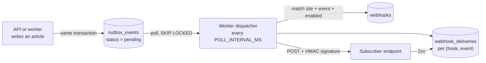

# Kal El — Webhooks and Events

What Kal El emits, how it is delivered and signed, and what a consumer must implement.

```
Reviewed against:
BRANCH: claude/kal-el-visual-ux-final-ade7eb
HEAD:   5de5b28b4a2a7a1d86a8f7a12b1493d3c73200f0
DATE:   2026-08-19
```

---

## 1. The pipeline



A **transactional outbox**: the event row is inserted in the *same database transaction* as
the state change, so an article can never be published without its event being queued, and
an event can never exist for a publish that rolled back.

Delivery is **at-least-once**. Consumers must be idempotent.

---

## 2. Events actually emitted

**Exactly one event type exists in practice.**

| Event | Declared in the subscribable enum | Ever emitted |
|---|---|---|
| `article.published` | yes | **yes** |
| `article.scheduled` | yes | **no — nothing emits it** |
| `article.updated` | yes | **no — nothing emits it** |

`article.scheduled` and `article.updated` can be subscribed to through the API and the CMS
picker, and will never deliver anything. Recorded in
[../KNOWN-ISSUES.md](../KNOWN-ISSUES.md).

`article.published` is emitted from three places, all with the same payload shape:

| Trigger | Where |
|---|---|
| `POST /articles` with `status: "published"` | `services/articles.ts` — `createArticle` |
| `POST /articles/{id}/publish` | `services/articles.ts` — `publishArticle` |
| The worker promoting a due scheduled article | `worker/scheduler.ts` — `promoteOne` |

**Exactly-once emission** is guaranteed by a deterministic key,
`article:<articleId>:publish:<publishedAt epoch ms>`, on the unique index
`outbox_idempotency_key_unique`, inserted with `ON CONFLICT DO NOTHING`. Publishing twice
at the same instant cannot queue two events.

`aggregateType` is always the literal `"article"`. No media, taxonomy, redirect or user
event exists.

---

## 3. The delivery request

```http
POST https://consumer.example.com/hooks/kalel HTTP/1.1
content-type: application/json
x-kal-el-event: article.published
x-kal-el-delivery: 4c2f9d3a-1b7e-4c8a-9f01-2d3e4f5a6b7c
x-kal-el-idempotency: article:7f0e.../publish:1755631200000
x-kal-el-signature: sha256=9a1c...64 hex chars...

{"articleId":"7f0e...","slug":"a-headline","publishedAt":"2026-08-19T18:00:00.000Z","version":3}
```

### Body

**There is no envelope.** The body is the stored outbox `payload`, serialised as-is:

| Field | Type | Notes |
|---|---|---|
| `articleId` | uuid | |
| `slug` | string or `null` | the slug at publish time |
| `publishedAt` | ISO 8601 string | |
| `version` | integer | the article version after the publish |

Not in the body: event id, event type, **site id**, delivery id, timestamp, attempt count,
aggregate type. The event type is in a header; **the site is nowhere in the delivery** — a
consumer serving several sites must infer it from which endpoint received the call, i.e.
register a different URL per site.

### Headers

| Header | Value | Stable across retries |
|---|---|---|
| `content-type` | `application/json` | — |
| `x-kal-el-event` | the event type, e.g. `article.published` | yes |
| `x-kal-el-delivery` | a fresh UUID | **no — new per attempt** |
| `x-kal-el-idempotency` | the outbox `idempotencyKey`, falling back to the event id | **yes — this is the dedupe key** |
| `x-kal-el-signature` | `sha256=<hex>` | recomputed, identical for identical bytes |

**Deduplicate on `x-kal-el-idempotency`, never on `x-kal-el-delivery`.**

There is **no timestamp header** and **no `User-Agent`**. Redirects are not followed
(`redirect: "manual"`), so a consumer must accept POSTs at the exact registered URL.

---

## 4. Verifying the signature

| Property | Value |
|---|---|
| Algorithm | HMAC-SHA256 |
| Key | the webhook's `secret`, as UTF-8 |
| Signed material | **the raw request body bytes, and nothing else** |
| Encoding | lowercase hex |
| Header format | `sha256=<64 hex chars>` |
| Comparison | constant-time over the whole header string, prefix included |

```python
import hashlib, hmac

def verify(secret: str, raw_body: bytes, header: str) -> bool:
    expected = "sha256=" + hmac.new(secret.encode(), raw_body, hashlib.sha256).hexdigest()
    return hmac.compare_digest(expected, header or "")
```

```python
# Flask — capture the RAW body, never a re-serialised dict
@app.post("/hooks/kalel")
def hook():
    if not verify(SECRET, request.get_data(), request.headers.get("x-kal-el-signature", "")):
        return "", 401
    event = request.headers.get("x-kal-el-event")
    key   = request.headers.get("x-kal-el-idempotency")
    if already_processed(key):
        return "", 200                      # at-least-once: dedupe on this
    handle(event, request.get_json())
    mark_processed(key)
    return "", 200
```

> **Use the raw bytes.** Re-serialising the parsed JSON happens to work today because
> PostgreSQL fixes jsonb key order at storage time, but it is not a guarantee — any change
> in key order or spacing breaks the HMAC.

> **No timestamp is signed**, so the signature alone gives no replay protection. A captured
> delivery stays valid forever against the same secret. Consumers should dedupe on
> `x-kal-el-idempotency` and treat the endpoint as internet-facing.

---

## 5. Retries and dead-lettering

Retry state is tracked **per `(webhook, outbox event)`** in `webhook_deliveries`, not per
event. One broken subscriber cannot burn its healthy siblings' attempts.

| Knob | Default | Configurable by |
|---|---|---|
| `maxAttempts` | **5** | not exposed as an env var |
| `baseDelayMs` | **1000** | not exposed |
| Request timeout | **10 s** | not exposed |
| Events claimed per tick | **20** | `OUTBOX_BATCH_SIZE` (max 500) |
| Poll interval | **1000 ms** | `POLL_INTERVAL_MS` |

Backoff is `baseDelayMs * 2^(attempt-1)` — **no jitter**:

| Attempt | Next retry after |
|---|---|
| 1 | 1 s |
| 2 | 2 s |
| 3 | 4 s |
| 4 | 8 s |
| 5 | none — **dead-lettered** |

Five HTTP attempts, roughly 15 s of cumulative backoff. A subscriber that is down for more
than about twenty seconds **loses the event permanently**.

| Situation | Treatment |
|---|---|
| `2xx` | success. The body is never read. |
| `3xx` | failure — redirects are not followed |
| `4xx` | **retried exactly like a 5xx.** There is no permanent-failure fast path. |
| `5xx` | retried |
| Network error / timeout | retried |
| SSRF refusal | retried, and **consumes an attempt** even though nothing was sent |

**Dead-letter:** the delivery row becomes `status = 'failed'` with `next_attempt_at = NULL`
and that hook is never contacted for that event again. **There is no replay endpoint and no
re-delivery API.** Recovering a missed event means re-publishing the article or
reconciling by polling `GET /articles?status=published`.

The outbox row itself becomes `published` when every subscriber succeeded (or there were
none), and `failed` only when **every** failing subscriber is exhausted.

Health is observable at `GET /v1/sites/{siteId}/ops-status` (`audit.read`), which reports
outbox `pending`/`due`/`failed`, the oldest pending timestamp, webhook `total`/`enabled`/
`failing`, and worker liveness.

---

## 6. Managing subscriptions

All under `/v1/admin/sites/{siteId}/webhooks`, permission **`tokens.manage` held at that
site**.

| Method | Path | Notes |
|---|---|---|
| GET | `/v1/admin/sites/{siteId}/webhooks` | list; includes `lastDelivery` per hook; **never returns `secret`** |
| POST | `/v1/admin/sites/{siteId}/webhooks` | `201`; **returns `secret` once** |
| PATCH | `/v1/admin/sites/{siteId}/webhooks/{webhookId}` | `url`, `events`, `description`, `enabled` |
| DELETE | `/v1/admin/sites/{siteId}/webhooks/{webhookId}` | permanent |

**Create body** (`createWebhookBodySchema`, `.strict()`):

| Field | Type | Required | Notes |
|---|---|---|---|
| `url` | URL ≤2048 | yes | **`http(s)` only**; validated against SSRF at registration |
| `events` | array of event enum, min 1 | yes | `article.published` \| `article.scheduled` \| `article.updated` |
| `description` | string ≤200 | no | operator-facing label |
| `secret` | string 16..128 | no | **generated if omitted** |

**Update body** (`updateWebhookBodySchema`, `.strict()`): `url`, `events`, `description`
(nullable), `enabled`.

> **`secret` is deliberately not updatable.** Rotating it silently would break the
> subscriber's verification with no way for them to know which key signed a given delivery.
> The honest path is to create a replacement webhook — whose new secret is shown once, as
> on creation — and delete the old one.

**Pausing:** `PATCH {"enabled": false}`. A paused subscriber is skipped entirely by the
dispatcher rather than attempted and failed, so it does not burn its retry budget while
being fixed, and the signing secret survives the pause.

`GET` returns each hook's **last delivery** (`lastDelivery`: status, attempt, HTTP status,
error, event type, timestamp) — without it, a dead-lettered endpoint is indistinguishable
from a healthy one that has not yet received anything.

---

## 7. SSRF protection

Outbound delivery is guarded in three layers:

1. **At registration**, the URL is validated (`http(s)` only, resolvable, not private).
2. **Before each attempt**, `assertDeliverableUrl` re-checks — catching a hostname
   re-pointed since registration, and failing fast before a socket is opened.
3. **Inside the socket's own DNS lookup**, `guardedFetch` validates the address actually
   being connected to. This is the only layer that closes DNS rebinding, because the
   address a pre-flight check resolved is not necessarily the one the socket uses.

Redirects are not followed, so a 302 from a validated public URL into a metadata service
cannot bypass all three.

`ALLOW_PRIVATE_WEBHOOKS=true` disables the private-address check in **all three** layers —
registration still rejects non-`http(s)` URLs but no longer rejects private or loopback
ones — and switches the worker to the platform `fetch`. Both the API and the worker
**refuse to boot in production** with it enabled.

---

## 8. Should a client use webhooks or polling?

| | Webhooks | Polling |
|---|---|---|
| Latency | ~1 s (one worker tick) | your interval |
| Requires | a public HTTPS endpoint | nothing |
| Events available | `article.published` only | any state, via `GET /articles?status=` |
| Missed-event recovery | **none — dead-letter is final** | inherent |
| Site identification | by endpoint URL only | explicit in the path |
| Rate limit | n/a | counts against 600/min |

**Recommendation.** If an external client only *writes* into Kal El, it needs neither.
If it must react to publication, webhooks give the lowest latency — but because a
dead-letter is unrecoverable, pair them with a periodic reconciliation poll
(`GET /articles?status=published`, walking `updatedAt` descending) as the safety net.

---

## 9. Reference consumer

`apps/fixture/src/server.ts` is a working subscriber used by the end-to-end tests. It
verifies the signature and answers `200`, echoing the idempotency and event headers back.

It is a **signature reference, not a complete consumer**: it does not deduplicate on
`x-kal-el-idempotency`, and it verifies against a re-serialised body rather than the raw
bytes. Your consumer should do both, as §4 describes.

---

## Implementation references

- `packages/events/src/index.ts` — `signWebhook`, `verifyWebhookSignature`, the four header constants
- `apps/worker/src/dispatcher.ts` — claim, dispatch, per-hook retry, dead-letter
- `apps/worker/src/scheduler.ts` — scheduled publication and its outbox insert
- `apps/worker/src/safe-fetch.ts`, `apps/worker/src/ssrf.ts` — the SSRF layers
- `apps/worker/src/worker.ts` — the tick loop, heartbeat and graceful shutdown
- `apps/api/src/services/webhooks.ts` — subscription CRUD and `lastDelivery`
- `apps/api/src/services/articles.ts` — the two API-side outbox inserts
- `apps/api/src/services/ops.ts` — the operational snapshot
- `packages/contracts/src/webhooks.ts` — `webhookEventSchema`, create/update bodies
- `packages/db/src/schema/system.ts` — `outbox_events`, `webhooks`, `webhook_deliveries`
- `apps/fixture/src/server.ts` — reference consumer
