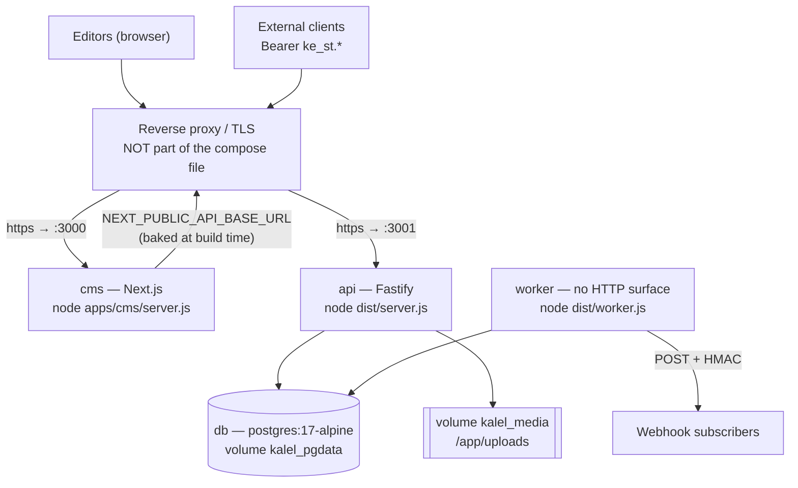

# Kal El — Deployment

The topology the code actually supports, and what must be set for it to boot.

```
Reviewed against:
BRANCH: claude/kal-el-visual-ux-final-ade7eb
HEAD:   5de5b28b4a2a7a1d86a8f7a12b1493d3c73200f0
DATE:   2026-08-19
```

---

## 1. Topology



Four services in `docker-compose.prod.yml`:

| Service | Image / build | Published ports | Depends on | Healthcheck | Volumes | Stop grace |
|---|---|---|---|---|---|---|
| `db` | `postgres:17-alpine` | **none** | — | `pg_isready -U kalel -d kalel`, 10 s / 5 s / 10 | `kalel_pgdata:/var/lib/postgresql/data` | — |
| `api` | build `apps/api/Dockerfile` | `3001:3001` | `db` healthy | `wget -qO- http://127.0.0.1:3001/ready`, 15 s / 5 s / 5 | `kalel_media:/app/uploads` | **30 s** |
| `worker` | build `apps/worker/Dockerfile` | none | `db` healthy | **none** | none | **40 s** |
| `cms` | build `apps/cms/Dockerfile` | `3000:3000` | `api` healthy | **none** | none | **20 s** |

All four `restart: unless-stopped`. Named volumes: `kalel_pgdata`, `kalel_media`.

```bash
docker compose --env-file .env.prod -f docker-compose.prod.yml up -d
```

### The reverse proxy is not in the compose file

TLS termination and public hostnames are the proxy's job. The API is published on the host
only so a panel-managed proxy can reach it. **Put it behind that proxy and set
`TRUST_PROXY` to match**, or the rate limiter buckets every user together.

The target environment described by the repository is a VPS with a panel-managed proxy
(Contabo / Easypanel-style). Any reverse proxy works; nothing depends on a specific one.

---

## 2. Images

| Service | Base | Build | Runtime contents | CMD |
|---|---|---|---|---|
| api | `node:22-alpine` | `pnpm install --frozen-lockfile`, `pnpm --filter @kal-el/api build` (tsup) | `apps/api/dist` → `./dist`, **`packages/db/drizzle` → `./drizzle`** | `node dist/server.js` |
| worker | `node:22-alpine` | `pnpm --filter @kal-el/worker build` | `apps/worker/dist` → `./dist` — **no migration folder** | `node dist/worker.js` |
| cms | `node:22-alpine` | `ARG NEXT_PUBLIC_API_BASE_URL`, `ENV NEXT_OUTPUT=standalone`, `pnpm --filter @kal-el/cms build` | `.next/standalone` → `./`, `.next/static` | `node apps/cms/server.js` |

All three set `ENV NODE_ENV=production`.

Two consequences worth stating:

- **Only the API image carries the migrations.** The worker cannot apply them. Keep
  `RUN_MIGRATIONS=true` on the API, or run migrations as a separate step.
- **`NEXT_PUBLIC_API_BASE_URL` is baked into the CMS image at build time.** Changing the
  API URL means rebuilding the CMS image; a runtime environment variable will not do it.
  Compose feeds it from `${API_BASE_URL:?set in .env.prod}` as a build arg.

---

## 3. Environment

Full inventory: [ENVIRONMENT.md](ENVIRONMENT.md). What matters at deploy time:

### Compose refuses to start without these

`POSTGRES_PASSWORD`, `DATABASE_URL`, `SESSION_SECRET`, `APP_BASE_URL`, `API_BASE_URL`,
`TRUST_PROXY`.

### The API refuses to boot in production unless

1. `COOKIE_SECURE=true`
2. `SESSION_SECRET` is not the development default
3. `SESSION_SECRET` is **≥ 32 characters**
4. `ALLOW_PRIVATE_WEBHOOKS` is not enabled
5. `LOG_LEVEL` is not `silent`
6. `TRUST_PROXY` states a policy — a hop count, a CIDR list, or the literal `direct`

`TRUST_PROXY=true` throws in **every** environment: it trusts the client-written left-most
`X-Forwarded-For`, which is spoofable per request and strictly worse than no proxy at all
for rate limiting. One proxy in front of the API is `TRUST_PROXY=1`.

### Hard-coded by production compose

`NODE_ENV=production`, `COOKIE_SECURE=true`, `RUN_MIGRATIONS=true`,
`MIGRATIONS_FOLDER=/app/drizzle`, `MEDIA_STORAGE_PROVIDER=local`,
`MEDIA_LOCAL_PATH=/app/uploads`, `PORT=3001`, `HOST=0.0.0.0`.

### `BOOTSTRAP_TOKEN`

Needed only while provisioning the first owner. **Remove it from the env file afterwards.**
The route refuses once a user exists, but there is no reason to keep a credential that
creates full-permission accounts sitting in the environment.

---

## 4. Health and readiness

| Path | Meaning | Touches the database | Rate limited |
|---|---|---|---|
| `/health`, `/v1/health` | **liveness** — the process is up | **no** | no |
| `/ready`, `/v1/ready` | **readiness** — `select 1` succeeded | yes | no |

```json
{ "status": "ok" }        // health
{ "status": "ready" }     // ready, 200
{ "status": "not_ready" } // ready, 503
```

Both are registered with and without the `/v1` prefix, because orchestrators and load
balancers are usually configured with a bare path.

- **Point the container/orchestrator liveness probe at `/health`.** It deliberately does
  not touch the database — a health check that fails during a brief database blip gets the
  container killed and restarted into the same blip.
- **Point the load balancer at `/ready`.** Compose's API healthcheck already does.

The readiness body never leaks the connection string or driver error; the reason is logged.

**The worker has no HTTP surface and no healthcheck.** Its liveness is observable only
through the `worker_heartbeats` table, surfaced by
`GET /v1/sites/{siteId}/ops-status` (permission `audit.read`), which reports `up`
(heartbeat within 60 s), `stale`, or `unknown`.

---

## 5. Logging

| Property | API | Worker |
|---|---|---|
| Format | Pino — JSON in production, readable stream otherwise | hand-rolled JSON |
| Level | `LOG_LEVEL`, defaulting by `NODE_ENV` | same, but a **narrower enum** (no `fatal`, no `trace`) |
| Request id | `genReqId` — 16 random bytes hex, on every log line and in `error.details.requestId` | — |
| Per-request line | `onResponse` hook | — |
| Redaction | allow-list serializers plus pino `redact` paths | **deny-list based** — `SECRET_KEYS` in `apps/worker/src/logger.ts`, applied at any depth |

A shared `LOG_LEVEL=trace` boots the API and **crashes the worker**. Use a level both
accept: `error`, `warn`, `info`, `debug`.

---

## 6. Graceful shutdown

Both processes handle `SIGINT` and `SIGTERM`:

1. stop accepting work;
2. drain in-flight requests / finish the current tick;
3. run `onClose` hooks — which is where the pg pool is ended;
4. exit 0.

A **second** signal exits immediately — a deliberate operator override.

A forced-exit timer bounds the wait: **15 s** for the API (`SHUTDOWN_GRACE_MS`, read with a
bare `Number()`), **20 s** for the worker (validated). Compose's `stop_grace_period` is set
above both: 30 s for the API, 40 s for the worker.

---

## 7. Deploy sequence

```bash
docker compose --env-file .env.prod -f docker-compose.prod.yml build
```

```bash
docker compose --env-file .env.prod -f docker-compose.prod.yml up -d
```

Order of effects:

1. `db` starts and becomes healthy.
2. `api` starts; with `RUN_MIGRATIONS=true` it applies migrations **before** listening,
   then seeds permissions and preset roles, then binds `:3001`.
3. `worker` starts and begins ticking.
4. `cms` starts once the API is healthy.

**Migrations run on API boot.** Two API replicas starting together both call
`runMigrations`; drizzle's migration table serialises them, but if you prefer a single
controlled step, set `RUN_MIGRATIONS=false` and run `pnpm migrate` as a release task.

There is **no down-migration runner**. A destructive schema change needs its reverse
written and tested before it ships.

### First-run provisioning

```bash
API_BASE_URL=https://api.example.com BOOTSTRAP_TOKEN=... KALEL_OWNER_PASSWORD=... pnpm bootstrap --site-slug portal --site-name "Portal" --email owner@example.com --name "Owner"
```

Then remove `BOOTSTRAP_TOKEN` from the environment and restart the API.

---

## 8. Scaling and constraints

| Component | Scaling |
|---|---|
| `api` | horizontally scalable — stateless apart from the media volume |
| `worker` | **safe to run several**, but there is no advantage: claims use `FOR UPDATE SKIP LOCKED` and scheduled promotion is a guarded `UPDATE`, so duplicates cannot occur — one is normally enough |
| `cms` | horizontally scalable |
| `db` | single instance in this topology |

**The media volume is the constraint on multi-replica API.** `MEDIA_STORAGE_PROVIDER`
accepts **only `local`**; files land on `/app/uploads`. Two API replicas need that volume
shared (NFS or equivalent) or one will 404 on the other's uploads. There is no S3/R2
provider implemented — the `StorageProvider` interface exists for one, but only
`LocalStorageProvider` is written. Recorded in [../KNOWN-ISSUES.md](../KNOWN-ISSUES.md).

Media is served through the API (`GET /v1/sites/{siteId}/media/{mediaId}/file`, permission
`media.read`) — **not** from a CDN, and not publicly. A public frontend needs its own path
to the bytes.

---

## 9. Security checklist

- [ ] `NODE_ENV=production` explicitly set on every service (it defaults to `development`)
- [ ] `SESSION_SECRET` ≥ 32 random characters, unique per environment
- [ ] `COOKIE_SECURE=true` and TLS terminated at the proxy
- [ ] `TRUST_PROXY` matches the real hop count or CIDR
- [ ] `CORS_ORIGINS` names the CMS origin explicitly (it falls back to `APP_BASE_URL`)
- [ ] `ALLOW_PRIVATE_WEBHOOKS` unset
- [ ] `BOOTSTRAP_TOKEN` removed after provisioning
- [ ] `ENABLE_DOCS` unset in production (Swagger UI is off by default there)
- [ ] `POSTGRES_PASSWORD` strong and matching `DATABASE_URL`
- [ ] database port not published to the internet (compose does not publish it)
- [ ] a backup schedule exists — **nothing schedules one for you**

Applied automatically: `@fastify/helmet` (CSP disabled, other headers on), a global
600 req/min limit, 10/min on login, 5/min on bootstrap, a 5 MiB body limit,
`MEDIA_MAX_BYTES` on uploads, magic-byte image validation, and three-layer SSRF protection
on webhook delivery.

---

## 10. What is not provided

| Missing | Note |
|---|---|
| Reverse proxy config | bring your own |
| TLS certificates | proxy's job |
| Object storage | only `local` is implemented |
| Automated backups | `pnpm backup` exists; nothing schedules it |
| Metrics / tracing | structured logs only; no Prometheus endpoint, no OpenTelemetry |
| Worker healthcheck | heartbeat table + `/ops-status` only |
| CDN for media | media is served by the API behind `media.read` |
| Down migrations | write and test the reverse before shipping a destructive change |

---

## Implementation references

- `docker-compose.prod.yml` — the topology
- `apps/api/Dockerfile`, `apps/worker/Dockerfile`, `apps/cms/Dockerfile`
- `apps/api/src/server.ts` — boot order, migrations, graceful shutdown
- `apps/api/src/config.ts` — production guards, `trustProxySetting`, `corsOrigins`
- `apps/api/src/app.ts` — helmet, CORS, rate limit, body limit, multipart
- `apps/api/src/routes/health.ts` — liveness and readiness
- `apps/api/src/logging.ts`, `apps/worker/src/logger.ts`
- `apps/worker/src/worker.ts` — tick loop, heartbeat, shutdown
- `apps/api/src/services/ops.ts` — the operational snapshot
- `.env.example` — the maintained template
