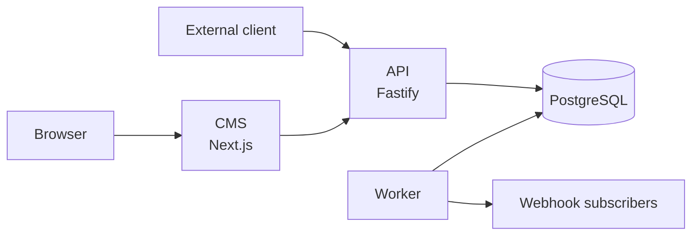

# Kal El — Product Overview

What Kal El is, who uses it, and where its responsibility ends.

```
Reviewed against:
BRANCH: claude/kal-el-visual-ux-final-ade7eb
HEAD:   5de5b28b4a2a7a1d86a8f7a12b1493d3c73200f0
DATE:   2026-08-19
```

---

## 1. What it is

**Kal El is a multi-site, API-first editorial CMS.** People and programs create content
once, attach it to a site and to structured taxonomy, preview it, move it through an
editorial workflow, publish or schedule it, and let downstream systems consume it through
stable APIs and events.

It is a **content operating system**, not a website. Nothing in this repository serves a
reader-facing page.

Two properties define it:

1. **API-first.** The REST API under `/v1` is the contract. The CMS is a client of it,
   exactly like an external automation is. Anything the CMS can do is reachable over HTTP —
   there is no private path and no direct database access for any client.
2. **Multi-site by construction.** Tenancy is not a feature bolted on; every editorial
   table carries `site_id`, every editorial route is under `/v1/sites/{siteId}`, and every
   credential is scoped.

---

## 2. Who uses it

| User | Interface | Credential |
|---|---|---|
| Writers, editors, chief editors | the CMS in a browser | session cookie + CSRF |
| Site administrators | the CMS admin screens | session cookie + CSRF |
| **External clients / automation** | the REST API directly | **service token** (`Authorization: Bearer ke_st.…`) |
| Downstream consumers | webhooks, or polling the API | the webhook's signing secret, or a token |
| Operators | health/readiness probes, `ops-status`, the audit log, `pnpm backup` | as above |

Both credential types go through the same routes, the same validation and the same
permission checks. A service token is not a back door — it is a first-class actor with a
name, a site, a scope list and an identity in the audit log.

---

## 3. What it does

| Capability | Detail |
|---|---|
| **Editorial storage** | articles with a structured JSON body, dek, excerpt, slug, type |
| **Versioning** | an integer `version` guarding every write; an append-only revision history |
| **Workflow** | six states, seven transitions, permission-gated, fully audited |
| **Scheduling** | future publication promoted by a background worker |
| **Taxonomy** | categories, tags, authors, entities, sources — site-scoped |
| **Media** | upload with magic-byte validation, metadata, focal point, in-use protection |
| **SEO** | per-article metadata and redirect records |
| **Preview** | signed, time-limited, `noindex` links for people who have no account |
| **Multi-site** | one installation, many titles, hard isolation |
| **RBAC** | flat permissions, five preset roles, per-site assignment |
| **Service tokens** | scoped, site-bound, revocable, attributable |
| **Audit** | who did what, to which object, from where, with which credential |
| **Events** | a transactional outbox drained to signed webhooks |
| **Idempotency** | exactly-once execution for retryable writes |
| **Recovery** | controlled repair of an unreadable article body |
| **Operability** | liveness, readiness, an operational status snapshot, logical backup |

---

## 4. What it deliberately does not do

Non-goals, stated in the product brief and true of the implementation:

- it is **not** a page builder or a website generator;
- it is **not** WordPress-plugin compatible;
- it does **not** execute arbitrary HTML, JavaScript or PHP from a body — the document
  schema admits only known node types and known marks;
- it does **not** impose a frontend framework;
- it does **not** include billing, self-service signup, or a public storefront;
- it does **not** acquire content: no feeds, no scraping, no AI writing. Those belong to
  external clients that call this API.

---

## 5. The three processes



| Process | Role |
|---|---|
| **API** | the only writer of record. Every rule — authentication, authorisation, validation, versioning, idempotency, audit, events — lives here. |
| **CMS** | the editorial interface. Holds no credential of its own; the browser's cookie is the credential. |
| **Worker** | unattended editorial time. Promotes scheduled articles and drains the outbox to webhooks. No HTTP surface. |

Detail: [../architecture/SYSTEM-ARCHITECTURE.md](../architecture/SYSTEM-ARCHITECTURE.md).

---

## 6. CMS versus public frontend

A recurring source of confusion.

| | CMS (`apps/cms`) | Public frontend |
|---|---|---|
| In this repository | **yes** | **no** |
| Audience | editorial staff | readers |
| Auth | session cookie + CSRF | none |
| Talks to | the API | the API, a cache, or its own store |
| Renders | editing surfaces, dashboards, previews | the published site |
| Owns | nothing durable | `<title>`, meta tags, OG, JSON-LD, sitemaps, `robots.txt`, serving redirects |

Kal El stores SEO **metadata** and redirect **records**; emitting tags and serving 301s is
the frontend's job. See [../editor/SEO.md](../editor/SEO.md).

---

## 7. External clients

An **external client** is any program that is not the CMS and writes to or reads from the
API with a service token: an importer, a nightly sync, a newsroom automation, a migration
script, a Python pipeline.

The contract it works against:

| Concern | Mechanism |
|---|---|
| Identity | a **service token**, bound to one site, carrying explicit scopes |
| Site | the UUID in the path — `/v1/sites/{siteId}/…` |
| Content identity | **`externalKey`**, unique per site, create-only |
| Safe retries | **`Idempotency-Key`**, 24-hour window, scoped per actor and site |
| Lost-update protection | **`version`** and `If-Match` |
| Failure semantics | machine-readable error codes with an explicit retry matrix |
| Reacting to publication | signed webhooks, or polling |
| Attribution | every write recorded against the token's id and name |

The complete contract:
[../integrations/EXTERNAL_CLIENT_API.md](../integrations/EXTERNAL_CLIENT_API.md).

**Permissions decide how far a client can go.** One holding `articles.create` +
`articles.submit` legitimately stops at "in review" and leaves publication to a human;
another holding `articles.publish` can take an article all the way to live. That is a
policy choice expressed in the token's scopes, not a limitation of the API.

---

## 8. Boundaries of responsibility

| Kal El | The client / the frontend |
|---|---|
| Stores and validates the article body | Produces it, and renders it |
| Owns slugs and slug-change redirects | Builds public URLs and serves the redirects |
| Stores media and validates the bytes | Resizes, transforms and serves at scale |
| Stores SEO metadata | Emits every tag |
| Runs the editorial workflow | Decides when to invoke it |
| Emits `article.published` | Decides what that means downstream |
| Records who did what | Reads that log and acts on it |
| Guarantees a retry cannot double-write | Sends a stable key |
| Refuses a stale write | Re-reads and reconciles |

The clean summary: **Kal El is responsible for the truth of the content and the rules
around changing it. Everything about acquiring content and everything about presenting it
lives outside.**

---

## 9. Where to go next

| You are | Start with |
|---|---|
| Writing an external client | [../integrations/EXTERNAL_CLIENT_API.md](../integrations/EXTERNAL_CLIENT_API.md) |
| Writing it in Python | [../integrations/PYTHON_CLIENT_EXAMPLE.md](../integrations/PYTHON_CLIENT_EXAMPLE.md) |
| Modelling content for ingestion | [../integrations/CONTENT-INGESTION-CONTRACT.md](../integrations/CONTENT-INGESTION-CONTRACT.md) |
| Consuming events | [../integrations/WEBHOOKS.md](../integrations/WEBHOOKS.md) |
| Working on Kal El itself | [../architecture/SYSTEM-ARCHITECTURE.md](../architecture/SYSTEM-ARCHITECTURE.md) |
| Running it | [../operations/LOCAL-DEVELOPMENT.md](../operations/LOCAL-DEVELOPMENT.md) |
| Deploying it | [../operations/DEPLOYMENT.md](../operations/DEPLOYMENT.md) |
| Looking for the sharp edges | [../KNOWN-ISSUES.md](../KNOWN-ISSUES.md) |

Historical product context: [../00-PRODUCT-VISION.md](../00-PRODUCT-VISION.md) and the
decision records in [../adr/](../adr/).
